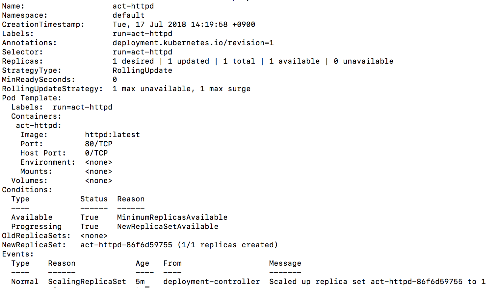
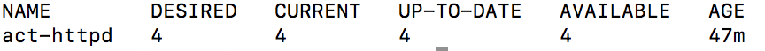
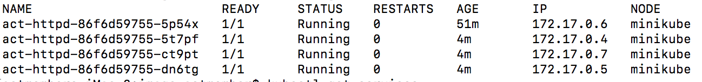
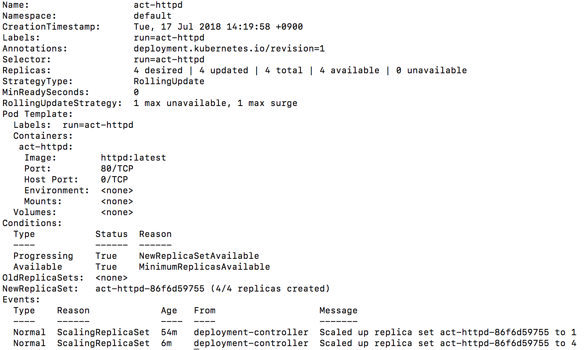
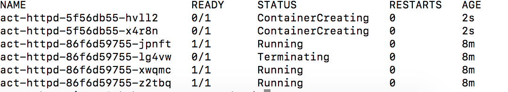
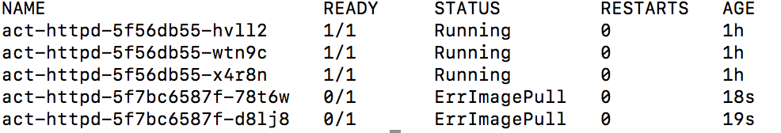

# [Minikube](https://kubernetes.io/docs/tutorials/hello-minikube/)
미니큐브는 로컬 컴퓨터에 가상 머신을 생성하고 하나의 노드만 포함하는 간단한 클러스터를 배포하는 작은 쿠버네티스입니다.

## 1. 설치
  * 필요한 Hypervisor(VirtualBox, VMware fusion, Hyperkit 등)를 설치합니다.

  * kubectl을 설치합니다.
  ~~~bash
  $ brew install kubectl
  ~~~

  * kubectl이 정상적으로 설치 되었는지 버전을 확인합니다.
  ~~~bash
  $ kubectl version
  ~~~

  * minikube를 설치합니다.(작성일 기준 0.28.0 버전 - [Release Version check](https://github.com/kubernetes/minikube/releases))
  ~~~bash
  $ curl -Lo minikube https://storage.googleapis.com/minikube/releases/v0.28.0/minikube-darwin-amd64 && chmod +x minikube && sudo mv minikube /usr/local/bin/
  ~~~
  혹은 Homebrew를 통해서 설치한다
  ~~~bash
  brew cask install minikube
  ~~~

  * minikube가 정상적으로 설치 되었는지 버전을 확인합니다.
  ~~~bash
  $ minikube version
  ~~~

## 2. Create Cluster

  

  * 클러스터를 생성합니다.
  ~~~bash
  $ minikube start
  ~~~
  혹은 vm-driver option을 시정하여 설정합니다. [오류 발생시 참고](https://github.com/kubernetes/minikube/blob/master/docs/drivers.md#hyperkit-driver)
  ~~~bash
  $ minikube start --vm-driver=hyperkit
  ~~~

  성공적으로 실행 되면 아래와 같은 화면을 볼 수 있습니다.
  

  * 클러스터 상태를 확인합니다.
  ~~~bash
  $ kubectl cluster-info
  ~~~

  * 마스터가 정상적으로 동작되었다면 클러스터의 노드를 확인합니다.
  ~~~bash
  $ kubectl get nodes
  ~~~

  미니큐브가 정상적으로 실행 되고 있는 것을 확인 할 수 있습니다.

## 2. Deploy

kubectl run 명령어로 클러스터에 컨테이너 인스턴스를 실행합니다.

kubectl run 은 복제 가능한 이미지를 실행하고 이렇게 실행된 컨테이너를 관리하는 deployment를 만들게 됩니다.

~~~bash
$ kubectl run act-httpd --image=httpd:latest --port=80
deployment.apps "act-httpd" created
~~~

kubectl 명령어로 실행 중인 팟을 확인 합니다.
~~~bash
$ kubectl get pods
~~~

아래와 같은 화면을 볼 수 있습니다.
  

쿠버네티스 내부의 팟은 현재 private 하고 고립된 네트워크에서 실행 되고 있습니다.

동일한 클러스터 내의 다른 팟 및 서비스에서 볼 수 있지만 외부에서는 볼 수 없습니다.

kubectl을 사용 할 때 API  엔드 포인트를 통해 상호 작용하여 통신합니다.

## 3. Expose

실행중인 팟을 서비스로 노출시키도록 합니다.

2번에서 실행 된 팟들은 고유의 IP가 존재하지만 이러한 IP는 서비스가 없으면 클러스터 외부에 노출 되지 않습니다. 서비스를 통해 각 응용프로그램들이 트래픽을 수신 할 수 있습니다.

서비스는 유형을 지정하여 다양한 방식으로 노출 될 수 있습니다.

* ClusterIP - Cluster 내부에서만 접근 가능

* NodePort - 각 Node에서 포트를 노출하고 클러스터 외부에서 접근이 가능합니다. ClusterIP 기능을 포함하고 있습니다.

* LoadBalancer - AWS 등의 클라우드 환경에 존재하는 LoadBalancer에게 노출시킵니다. NodePort 기능을 포함하고 있습니다.

kubectl expose 는 deployment, service, replica set, replication controller, pod 을 이름별로 찾아보고 지정된 포트를 사용해 외부에 서비스 합니다.

~~~bash
$ kubectl expose deployment act-httpd --type=NodePort
service "act-httpd" exposed
~~~

아래의 명령어로 생성된 서비스를 자세히 확인 할 수 있습니다.
~~~bash
$ kubectl describe services/act-httpd
~~~

다음으로 포트를 노출 하였으니 접근을 해보도록 하겠습니다.

~~~bash
$ kubectl get services
~~~

위와 같은 명령어를 실행하면 아래와 같은 화면이 보입니다.

여기서 act-httpd의 PORT(S)를 보면 80:32248이 보이는데

80은 클러스터 내부에서 해당 컨테이너의 포트를 의미하고

32248은 외부에서 접근 가능한 포트를 의미합니다.

따라서 웹 브라우저에서 http://[minikube ip]:32248 를 실행하면 됩니다.

minikube ip는

아래의 명령어를 통해서 확인이 가능합니다.

~~~bash
$ minikube ip
~~~

## 4. Label

deployment가 생성 되면 팟에 라벨이 자동으로 생성이 됩니다.

다음 명령어로 확인 할 수 있습니다.

~~~bash
$ kubectl describe deployment
~~~

위 그림에서 Labels라는 항목에 보이는 것(run=act-httpd)이 라벨 이름입니다.

아래의 명령어로 팟의 정보를 확인 할 수 있습니다.

~~~bash
$ kubectl get pods -l run=act-httpd
~~~

라벨 이름을 변경하고 싶으면 팟의 오브젝트 이름을 이용하여 변경 할 수 있습니다.

~~~bash
$ kubectl label pod act-httpd-86f6d59755-5p54x app=act-httpd
~~~

## 5. Scaling

기존의 deployment를 scale하여 복제하도록 하겠습니다.

~~~bash
$ kubectl scale deployments/act-httpd --replicas=4
~~~

아래의 명령어를 통해서 복제가 잘 되었는지 확인 합니다.

~~~bash
$ kubectl get deployments
~~~

* DESIRED - 구성된 복제본 수

* CURRENT - 현재 실행중인 복제본 수

* UP-TO-DATE - 원하는 (구성된) 상태와 일치하도록 업데이트 된 복제본 수

* AVAILABLE - 사용자에게 실제로 얼마나 많은 복제본이 사용 가능한지를 나타냄

변경 사항이 적용되었으며 4 가지 응용 프로그램 인스턴스를 사용할 수 있습니다. 다음으로 팟의 갯수가 변경되었는지 확인합니다.

~~~bash
$ kubectl get pods -o wide
~~~

IP 주소가 다른 4 개의 팟을 확인 할 수 있습니다. 변경 내용은 배포 이벤트 로그에 등록되었고 확인하려면 아래처럼 describe 명령어를 사용합니다.

~~~bash
$ kubectl describe deployments/act-httpd
~~~

replica의 갯수를 줄이고 싶으면 아래의 명령어를 이용합니다.

~~~bash
$ kubectl scale deployments/act-httpd --replicas=2
~~~

## 6. Update

사용자는 끊김 없는 서비스를 이용하기를 바라며 개발자는 하루에 여러번 새로운 버전을 배포 할 일이 존재합니다. 따라서 쿠버네티스에서는 롤링 업데이트를 수행합니다. 롤링 업데이트를 사용하면 팟 인스턴스를 새로운 인스턴스로 점진적으로 업데이트 하여 가동 중지 시간 없이 업데이트를 수행 할 수 있습니다.

현재 httpd:latest 컨테이너가 실행이 되고 있는데 이 이미지를 nginx:latest로 교체하도록 하겠습니다.

~~~bash
$ kubectl get deployments
~~~

~~~bash
$ kubectl get pods
~~~

위의 명령어를 실행하게 되면 현재 4개의 팟이 실행 되고 있다는 것을 볼 수 있습니다.

아래 명령어를 통해 실행중인 이미지를 교체합니다.

~~~bash
$ kubectl set image deployments/act-httpd act-httpd=nginx:latest
~~~

그리고 바로 아래 명령어를 통해 변경되는 팟의 상태를 확인합니다.
~~~bash
$ kubectl get pods
~~~

아래 그림과 같이 새로운 컨테이너가 생성되고 기존의 컨테이너는 종료가 되고 있는 것을 확인 할 수 있습니다.

아래 명령어를 통해서 rollout이 성공했는지 확인 할 수 있습니다.
~~~bash
$ kubectl rollout status deployments/act-httpd
deployment "act-httpd" successfully rolled out
~~~

만약 없는 이미지 세팅과 같은 문제로 인해서 제대로 실행되지 않을 경우 undo 명령어를 실행해야 합니다.

먼저 존재하지 않는 이미지를 세팅합니다.(nginx:99.9)

~~~bash
$ kubectl set image deployments/act-httpd act-httpd=nginx:99.9
~~~

그 다음 pod 상태를 확인합니다.
~~~bash
$ kubectl get pods
~~~

다음과 같이 pod이 잘 못 되었음을 확인 할 수 있습니다.

rollout undo 명령어를 통해 이전 상태로 복원합니다.

~~~bash
$ kubectl rollout undo deployments/act-httpd
~~~

다시 pod 상태를 확인하면 이전 상태로 돌아온 것을 확인 할 수 있습니다.

## 7. 대시보드

아래와 같은 명령어를 실행하면 쿠버네티스의 대시보드 화면을 볼 수 있습니다.

~~~bash
$ minikube dashboard
~~~

