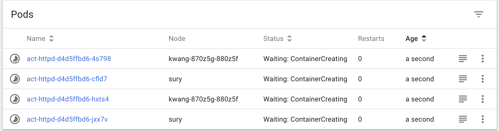
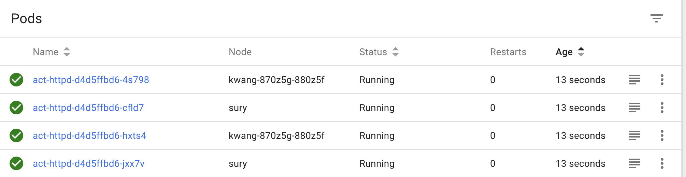
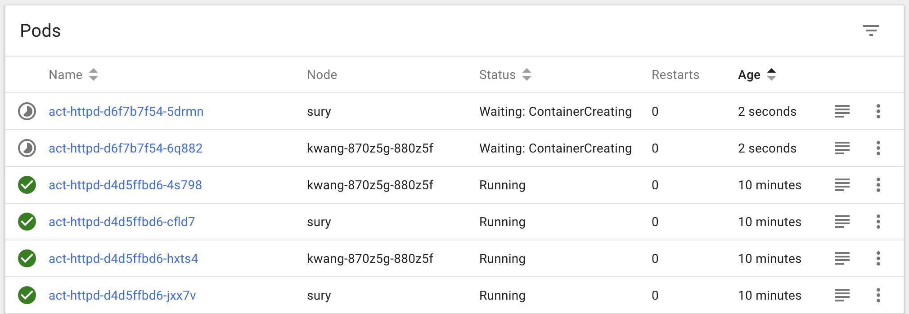
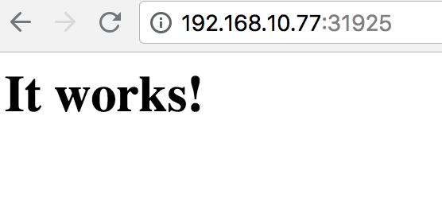
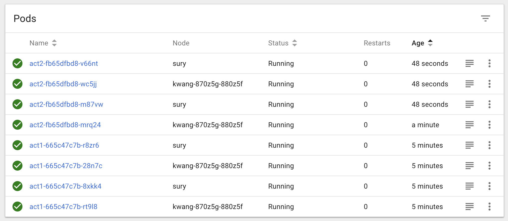
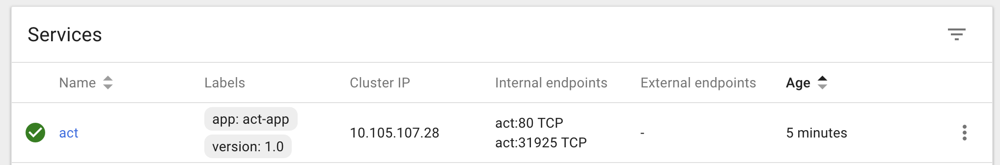
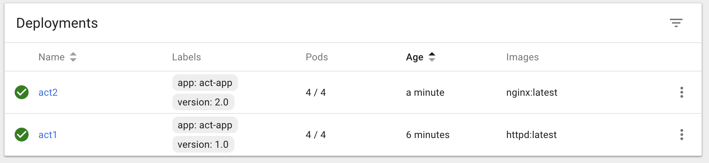
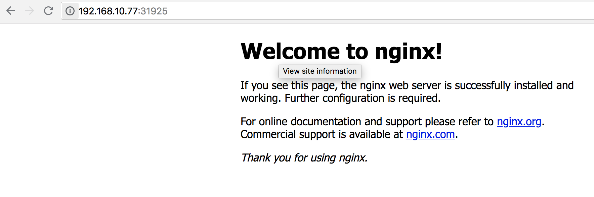
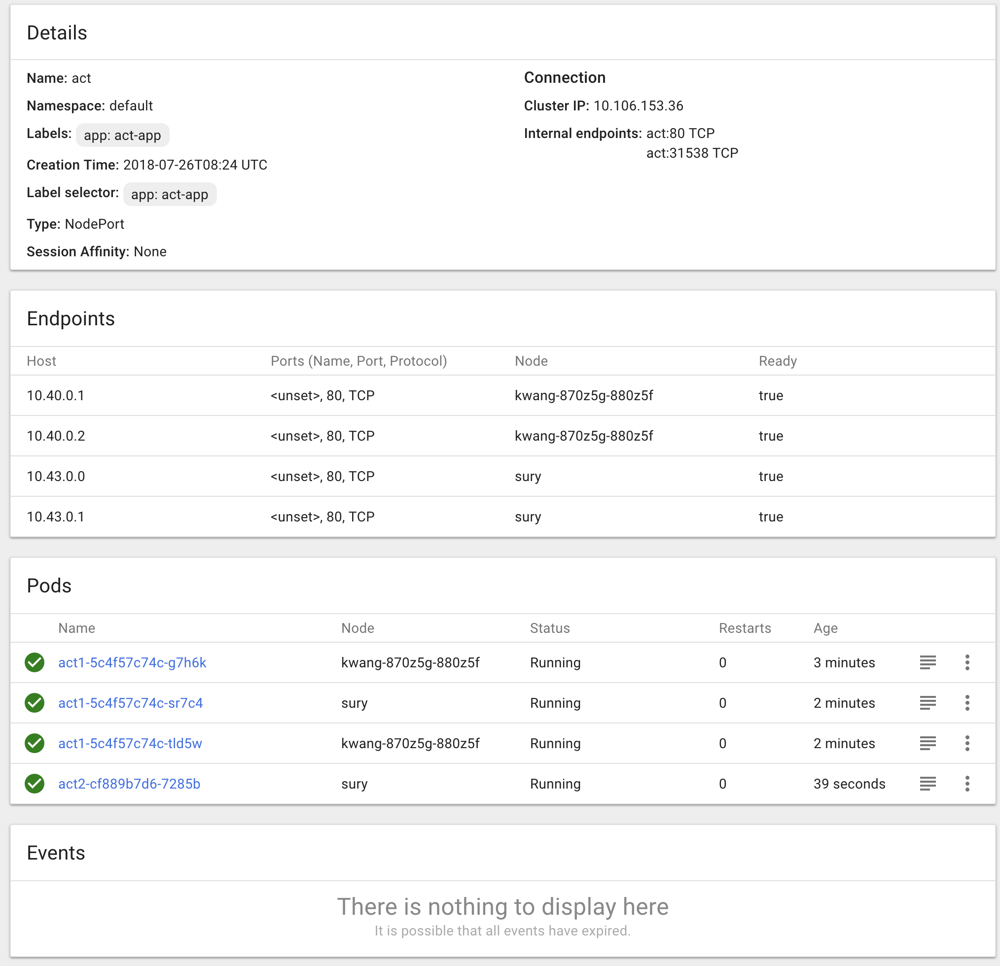

# 쿠버네티스 배포 전략

## 1. 개요
쿠버네티스에는 응용 프로그램을 릴리즈하는 여러가지 방법이 존재합니다.

응용 프로그램을 업데이트 하는 동안 인프라를 신뢰할 수 있는 전략을 선택해야 합니다.

배포 절차를 선택하는 것은 필요에 따라 다르며 몇가지 전략이 아래와 같이 존재합니다.

* recreate - 이전 버전을 종료하고 새로운 버전을 릴리즈 합니다.

* ramped - 롤링 업데이트 방식으로 새로운 버전을 하나씩 릴리즈 합니다.

* blue/green - 이전 버전과 함께 새버전을 출시 한 다음 트래픽을 새 버전으로 전환합니다.

* canary - 하위 버전의 사용자에게 새 버전을 출시 한 다음 전체 출시로 진행합니다.

* a/b testing -

## 2. recreate
실행중인 모든 인스턴스를 종료 한 이후 최신 버전으로 다시 작성합니다.

일반적으로 개발 환경에서 자주 사용 됩니다.

응용 프로그램의 종료 및 부팅 시간에 따라 가동 중지 시간이 길어 질 수 있습니다.

deployment 객체의 strategy를 recreate로 변경하겠습니다.

변경 방법은 쿠버네티스 대쉬보드를 이용하거나 커맨드를 이용하여 수정하시면 됩니다.

~~~bash
$ kubectl edit deployment/act-httpd
~~~

~~~yml
apiVersion: extensions/v1beta1
kind: Deployment
metadata:
  ...
spec:
  ...
  strategy:
    type: Recreate
  template:
    ...
status:
...
~~~

현재 httpd 이미지로 띄워진 팟을 nginx로 변경해보겠습니다.

~~~bash
$ kubectl set image deployment/act-httpd act-httpd=nginx:latest
~~~

아래의 화면과 같이 한꺼번에 종료 된 이후 생성이 되는 것을 확인 할 수 있습니다.

## 3. ramped
ramped 배포는 롤링 업데이트 방식 중 하나로 팟을 업데이트하고 새로운 버전의 어플리케이션으로 보조 ReplicaSet을 생성 한 다음 이전 버전의 복제본 수를 줄이고 정확한 수의 복제본에 도달 할 때까지 새로운 버전을 증가시킵니다.

인스턴스간에 천천히 릴리즈가 됩니다.

데이터의 재조정을 처리 할 수 있는 상태 보존형 어플리케이션에 좋습니다.

다만 롤아웃/롤백에 시간이 오래 걸리는 편이고 여러 API 지원이 힘듭니다.

recreate에서 nginx로 바꿨는데 ramped방식으로 httpd로 바꿔 보도록 하겠습니다.

~~~bash
$ kubectl edit deployment/act-httpd
~~~

maxSurge는 업데이트 도중 증가시킬 팟의 수 입니다.
maxUnavailable는 업데이트 도중 사용할 수 없는 팟 수를 정의합니다.

~~~yml
apiVersion: extensions/v1beta1
kind: Deployment
metadata:
  ...
spec:
  ...
  strategy:
    type: Rolling Update
    rollingUpdate:
      maxSurge: 2      
      maxUnavailable: 0
  template:
    ...
status:
...
~~~

이제 이미지를 변경합니다.
~~~bash
$ kubectl set image deployment/act-httpd act-httpd=httpd:latest
~~~

아래 사진과 같이 팟이 증가하면서 변경 되는 것을 확인 할 수 있습니다.

## 4. Blue/Green

청녹 배포는 녹색 버전의 응용프로그램이 파란색 버전과 함께 배포 되기 때문에 일반적인 확장 배포와 다릅니다. 새버전이 요구 사항을 충족하는지 테스트 한 후 로드 밸런서 역할을 하는 쿠버네티스 서비스 객체를 업데이트하여 select 필드의 버전 레이블을 바꾸어 새 버전으로 트래픽을 보냅니다.

버전관리 문제를 방지하지만 자원을 두배로 늘려야 하는 단점이 존재합니다.

전체적인 흐름은 다음과 같습니다.

* 기존 버전1로 트래픽을 진행합니다.

* 버전2를 deploy합니다.

* 버전2가 준비 될 때까지 기다립니다.

* 버전1로 들어오는 트래픽을 버전2로 바꿉니다.

* 버전1을 종료합니다.

이전 작업에서 만들어졌던 deployment 들을 모두 제거하고 처음부터 시작하겠습니다.

먼저 버전1(httpd)을 만들고 서비스로 등록합니다.

아래 명령어를 보다시피 label을 별도로 지정하였습니다.
~~~bash
$ kubectl run act1 --image=httpd:latest --port=80 --labels="app=act-app,version=1.0"
$ kubectl scale deployment act1 --replicas=4
$ kubectl expose deployment act1 --type=NodePort --name=act
~~~

위의 명령어가 성공하였다면 해당 서비스의 포트를 확인합니다.

~~~bash
$ kubectl get svc/act
NAME         TYPE        CLUSTER-IP      EXTERNAL-IP   PORT(S)        AGE
act          NodePort    10.105.107.28   <none>        80:31925/TCP   31s
~~~

현재 31925로 노출 되고 있는 것을 확인 할 수 있습니다.

웹브라우저로 접속을 해봅니다.

httpd기본화면을 확인 할 수 있습니다.

이제 변경할 버전2(nginx) 를 deployment로 만들겠습니다.

버전1의 라벨과 version 부분이 달라진 것을 확인 할 수 있습니다.

~~~bash
$ kubectl run act2 --image=nginx:latest --port=80 --labels="app=act-app,version=2.0"
$ kubectl scale deployment act2 --replicas=4
~~~

대쉬보드 화면이나 명령어를 실행하게 되면 deployment는 2개, 팟은 총 8개, 서비스는 한개인 것을 확인 할 수 있습니다.

버전2의 팟들이 성공적으로 실행되면 patch 명령을 이용하여 서비스의 팟들을 교체하도록 합니다.
~~~bash
$ kubectl patch service act -p '{"spec":{"selector":{"version":"2.0"}}}'
~~~

다시 브라우저를 확인하도록 합니다.

nginx 기본 화면으로 변경 된 것을 확인 할 수 있습니다.

버전1을 종료합니다.(deployment 삭제)

~~~bash
$ kubectl delete deployment act1
~~~

## 5. Canary

카나리아 배포는 사용자의 하위 집합 중 하나를 새로운 기능으로 라우팅하는 것으로 구성 됩니다.

새로운 버전 하나가 이전 버전과 함께 릴리즈가 됩니다. 그런 다음 일정 시간 이후 오류가 발견되지 않으면 새 버전의 복제본 수를 늘리고 이전 배포를 삭제하는 방식입니다.

빠른 롤백이 가능하다는 장점이 있지만 롤아웃 자체는 느린 편이며 미세 조정된 트래픽 분배는 비용이 들어 갈 수 있습니다.

아래에서 보여드릴 절차는 쿠버네티스 네이티브 입니다. ReplicaSet에 의해 관리되는 복제본 수를 조정하여 버전간의 트래픽을 분산시키는 방법입니다.

만약 새로운 기능의 출시가 기존 시스템의 안정성에 확신이 없는 경우 카나리아 전략을 사용하는 것이 좋습니다.

먼저 버전1을 만듭니다.

blue/green 예제와 다른 점은 label에 버전이 없다는 점입니다.

~~~bash
$ kubectl run act1 --image=httpd:latest --port=80 --labels="app=act-app"
$ kubectl scale deploy act1 --replicas=3
$ kubectl expose deploy act1 --type=NodePort --name=act
~~~

그 다음 버전2를 만듭니다.

~~~bash
$ kubectl run act2 --image=nginx:latest --port=80 --labels="app=act-app"
~~~

이후 대쉬보드에서 act 서비스의 상세화면을 보면 총 4개의 팟이 서비스 안에 존재함을 알 수 있습니다.

selector가 동일한 라벨을 가진 것들을 읽어오기 때문입니다.

~~~bash
$ while sleep 0.1; do curl http://192.168.10.77:31538/; done
~~~

위 명령어를 실행하면 현재 httpd와 nginx의 기본 페이지가 번갈아가면서 출력 되는 것을 볼 수 있습니다.

버전2가 성공적으로 실행이 된다고 생각하면

버전2의 replicas 수를 늘리고 버전1의 deployment를 제거하도록 합니다.

~~~bash
$ kubectl scale deploy act2 --replicas=4
$ kubectl delete deploy act1
~~~

## 6. A/B testing

A/B 테스트는 실제로 배포 전략이 아닌 통계를 기반으로 비즈니스 결정을 내리는 기술입니다. 그러나 카나리아 배포와 관련이 있기 때문에 설명을 합니다.

가중치에 따라 버전간에 트래픽을 분산시키는 것 외에도 몇가지 매개변수(쿠키, 사용자 에이전트 등)를 기반으로 특정 사용자 풀을 정확하게 타겟팅 할 수 있습니다.

이 기술은 주어진 기능의 변환을 테스트하고 가장 많이 변환하는 버전만 롤아웃 하는데 자주 사용됩니다.

Istio는 다른 서비스 meshes와 마찬가지로 가중치 및 / 또는 HTTP 헤더를 기반으로 동적 요청 라우팅을 통해 서비스 인스턴스를 세분화 하는 방법을 제공합니다.

흐름은 다음과 같습니다.

* 버전1은 Istio를 이용하여 HTTP 트래픽을 제공합니다.

* 버전2를 deploy합니다.

* 인스턴스가 준비 될 때까지 기다립니다.

* 특정 헤더를 통해서 버전2로 접속합니다. 만약 버전2가 성공적으로 작동한다면 버전2로 변경합니다.

먼저 Istio를 설치합니다.

~~~bash
$ curl -L https://git.io/getLatestIstio | sh -
$ cd istio-0.8.0
$ export PATH=$PWD/bin:$PATH
$ kubectl apply -f install/kubernetes/istio-demo.yaml
~~~

대쉬보드 화면에서 모든 팟이 정상적으로 실행 됨을 확인하거나 다음 명령어를 통해서 확인하도록 합니다.

~~~bash
$ watch kubectl get pods -n istio-system
~~~

정상적으로 실행이 되었다면 2개의 deployment를 생성합니다.
~~~bash
$ kubectl run act1 --image=httpd --labels='app=act-app,version=1.0'
$ kubectl run act2 --image=nginx --labels='app=act-app,version=2.0'
$ kubectl scale deploy act1 --replicas=3
$ kubectl run act1 --image=httpd --labels='app=act-app,version=1.0' --port=80
$ kubectl run act2 --image=nginx --labels='app=act-app,version=2.0' --port=80
~~~

다음으로 istioctl 명령을 사용하여 두 응용 프로그램을 모두 배포하여 프록시 요청에 사용되는 istio 사이드카 컨테이너를 주입합니다.

~~~bash
$ kubectl get deploy/act1 -o yaml | istioctl kube-inject -f - | kubectl apply -f -
$ kubectl get deploy/act2 -o yaml | istioctl kube-inject -f - | kubectl apply -f -
~~~

다음으로 아래의 yaml 파일을 만들어 줍니다.
gateway와 라우팅 정보를 가지고 있는 virtualservice입니다.

라우팅 정보를 보면 헤더 정보에 x-api-version을 v.1.0.0을 입력하면 act1 서비스로 라우팅을 하고 v.2.0.0을 입력하면 act2로 라우팅을 하는 것을 확인 할 수 있습니다.
~~~yml
apiVersion: networking.istio.io/v1alpha3
kind: Gateway
metadata:
  name: act-gateway
  labels:
    app: act-app
spec:
  selector:
    istio: ingressgateway # use istio default controller
  servers:
  - port:
      number: 80
      name: http
      protocol: HTTP
    hosts:
    - "*"
---
apiVersion: networking.istio.io/v1alpha3
kind: VirtualService
metadata:
  name: act-info
  labels:
    app: act-app
spec:
  hosts:
  - "*"
  gateways:
  - act-gateway
  http:
    - match:
       - headers:
           x-api-version:
             exact: v.1.0.0
       route:
       - destination:
           host: act1
     - match:
       - headers:
           x-api-version:
             exact: v.2.0.0
       route:
       - destination:
           host: act2
~~~

위 파일을 작성하였다면 kubectl로 apply를 해줍니다.

~~~bash
$ kubectl apply -f ./[파일명].yaml
~~~

다음으로 istio-ingressgateway의 포트번호를 확인합니다.
~~~bash
$ kubectl get svc/istio-ingressgateway -n istio-system
~~~

아래의 명령어를 입력하여 v.2.0.0이 정상적으로 작동하는지 확인합니다.
~~~bash
$ curl http://192.168.10.77:31380 -H 'x-api-version: v.1.0.0'
~~~

nginx(act2서비스)가 정상적으로 작동 되었다고 생각이 되면 act2의 replicas를 증가하고 act1을 종료 합니다.

# 7. 기타
위 예제는 화면의 변화를 바로 보여주기 위해서 nginx와 httpd를 기준으로 설명하였습니다.

실제 운영단계에서는 보통 같은 이미지(어플리케이션)를 기준으로 태그만 다르게 하여(1.0.1 -> 1.0.2) 배포 전략을 세우는 것이 일반적일 것입니다.

따라서 위 예제를 참고로 배포 전략을 만들고 파이프라인을 구성하시길 바랍니다.

# 8. 출처
https://container-solutions.com/kubernetes-deployment-strategies/
