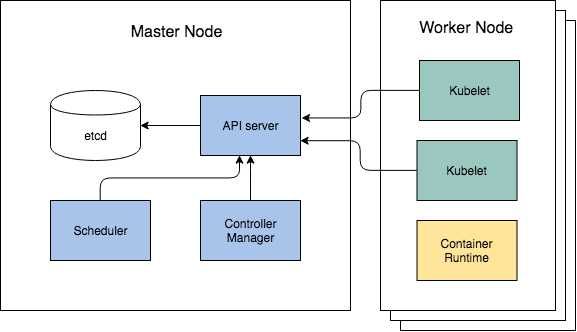
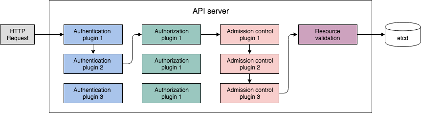
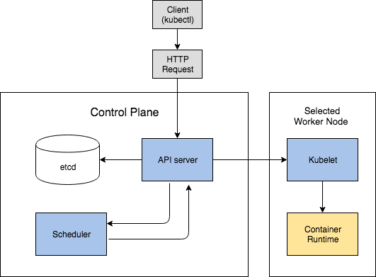

## 1. Kubernetes Components

**control plane (master node)**
 - etcd  
 - Scheduler
 - API server
 - Controller Manager

**worker node**
 - kube-proxy
 - kubelet
 - container runtime (docker, rkt..)

**add-on**
 - DNS server
 - Dashboard
 - Ingress controller
 - Heapster
 - Container network interface network plugin

### 컴포넌트들은 어떻게 통신할까  
쿠버네티스 시스템 컴포넌트들은 API 서버를 통해서만 통신할 수 있을 뿐, 서로 직접적으로 통신할 수 없습니다.
오직 API 서버만 etcd에 접속할 수 있기 때문에, 다른 컴포넌트들이 클러스터 상태를 변경하려면 API 서버에 호출을 해야합니다.  

Control Plane의 컴포턴트들은 다중 서버에 분산될 수 있습니다. 각 컴포넌트의 인스턴스를 두 개 이상 실행시켜 고가용성을 유지할 수 있습니다.  
etcd와 API 서버의 다중 인스턴스는 동시에 병렬로 job을 수행하지만 Scheduler와 Controller Manager는 오직 단일 인스턴스만 활성화됩니다. (그 외 인스턴스들은 대기상태를 유지)


### 컴포넌트들은 어떻게 실행될까
Control Plane 컴포넌트들과 kube-proxy는 시스템에 직접 배포될 수도 있고 Pod으로 실행될 수도 있습니다.
Kubelet만 항상 시스템 컴포넌트로 실행되고 Kubelet이 다른 모든 컴포넌트들을 Pod으로 실행시킵니다. 따라서 Control Plane 컴포넌트들이 Pod으로 실행되기 위해선 Kubelet이 마스터 노트에 배포되어야 있어야 합니다.

아래와 같이 kube-system namespace의 Pod들을 조회해보면 Control Plane 컴포넌트들이 마스터노드에 Pod으로 실행되고 있습니다. 또한 세 개의 worker node가 있고 각 노드에서는 kube-proxy가 실행되고 있습니다.  
```sh
$ kubectl get pod -o custom-columns=POD:metadata.name,NODE:spec.nodeName --sort-by spec.nodeName -n kube-system  

POD                                       NODE
weave-net-98pks                           kube-01
kube-proxy-r27cw                          kube-01
weave-net-vjnjp                           kube-02
kube-proxy-9h5pl                          kube-03
weave-net-sbppq                           kube-03
kubernetes-dashboard-767dc7d4d-ngpvk      kube-03
kube-proxy-c9525                          kube-master
etcd                                      kube-master
kube-scheduler                            kube-master
kube-controller-manager                   kube-master
coredns-78fcdf6894-njnfp                  kube-master
weave-net-rnm8b                           kube-master
kube-apiserver                            kube-master
coredns-78fcdf6894-gh9rc                  kube-master
```

## 2. etcd
Pods, Service, Secrets 등등 모든 오브젝트들은 어딘가에 영구적으로 저장되어 API 서버가 재시작 되거나 실패하더라도 모든 manifest 데이터가 유지되어야 합니다. 이를 위해 쿠버네티스는 빠른 분산형 key-value 스토어인 etcd를 사용합니다. 분산형이기때문에 다중 인스턴스를 통해 고가용성과 고성능을 보장할 수 있습니다.
> etcd를 다중 인스턴스로 클러스터링할때는 홀수개로 유지해야 합니다.
클라이언트가 API 서버를 통해 etcd를 접근할 때 각 인스턴스별로 상태가 다를 수 있습니다. (actual state 또는 past state)
consensus 알고리즘은 클러스터가 next state로 변경할 때 현재 존재하는 인스턴스 개수가 과반수(majority)를 넘어야 합니다.
예를들어, 두 개의 etcd 인스턴스가 클러스터링되어 있고 한개의 인스턴스가 다운됐다면 남아있는 하나의 인스턴스는 majority 개수를
충족하지 못 하므로 state change는 불가합니다. 따라서 짝수 개수로 인스턴스 개수를 늘리는 것은 무의미합니다.
보통 규모가 큰 클러스터의 경우 5개나 7개가 적정입니다. 각각은 2개, 3개 인스턴스 다운까지 견딜 수 있습니다.  

API 서버 컴포넌트만이 etcd에 직접 접근할 수 있습니다. 다른 컴포넌트들이 etcd 데이터를 읽고 쓰려면 API 서버를 통해 간접적으로 요청해야합니다. 이를 통해, 요청에 대한 validation과 concurrency를 유지할 수 있고, API 서버 외에 다른 컴포넌트들을 실제 스토리지 매커니즘으로 부터 분리하여 나중에 스토리지를 쉽게 교체할 수 있도록 해줍니다.  
etcd는 쿠버네티스가 클러스터 상태와 메타데이터를 저장하는 유일한 장소입니다.  

> Optimistic locking
데이터에 lock을 걸어 read나 update가 불가능하게 만드는 대신 버전넘버를 통해 Concurrency를 유지한다.
데이터는 버전넘버를 갖고 업데이트가 될 때마다 버전넘버를 증가시키므로 업데이트 시, 버전넘버를 통해 최신 데이터인지 확인한다.
모든 쿠버네티스 리소스들은 metada.resourceVersion 필드를 갖고 클라이언트가 오브젝트를 업데이트할 때 API 서버에 함께 전달한다. 만약 버전이 etcd에 저장된 버전과 맞지 않으면 API 서버는 업데이트를 수행하지 않는다.

### 리소스들은 어떻게 etcd에 저장될까
쿠버네티스는 etct version2나 version3를 사용하나 v3을 권장합니다.
etcd v2는 key를 파일시스템의 파일들처럼 계층형 구조로 저장합니다. 따라서 각 key는 디렉토리이거나 value를 가지는 자체 key가 됩니다. 쿠버네티스는 /registry 아래에 모든 데이타를 저장합니다.

```sh
# HTTPS 인증이 필요할 경우 인증서와 키파일 경로를 함께 명시해야 함
# ETCDCTL_API 환경변수가 등록되지 않았을 경우 default는 v2이므로 command가 달라질 수 있음
$ ETCDCTL_API=3 etcdctl [--endpoints=https://[127.0.0.1]:2379 --cacert={file_path} --cert={file_path} --key={file_path}] get /registry --prefix=true --keys-only
```

아래와 같은 명령어로 default namespace의 pod에 대한 manifest 정보를 조회할 수 있습니다.  
```sh
$ etcdctl get /registry/pods/default/nginx
{"kind":"Pod","apiVersion":"v1","metadata":{...}}
```

JSON 형태의 Pod 정보가 조회되는 것을 확인할 수 있습니다. API 서버는 etcd에 리소스 정보를 JSON 파일로 저장할 뿐입니다.   

## 3. API server
API 서버는 RESTful API를 통해 클러스터 상태를 변경하는 CRUD 인터페이스를 제공하고 데이터를 etcd에 저장합니다.
또한 validation을 통해 오브젝트 설정이 맞는지 확인하여 맞지 않으면 etcd에 저장하지 않습니다.  
optimistic locking을 통해 클라이언트가 동시에 업데이트 할 경우 Concurrency를 유지하도록 합니다.  

우리가 사용하고 있는 kubectl 커맨드 툴은 API 서버 클라이언트 중 하나입니다. 예를들어, JSON 파일로 리소스를 생성할 때 kubectl은 API 서버에 HTTP POST 요청을 합니다.  
아래 이미지는 HTTP 요청을 할 때 API 서버에서 실행되는 프로세스입니다.  

- Authentication : 허가 된 클라이언트가 요청을 보냈는지 확인합니다.
- Authorization : 클라이언트가 요청한 리소스에 대한 권한이 있는지 확인합니다.
- Admission Control : CUD(READ 제외) 요청인 경우 default 값을 세팅해 주거나 관련된 다른 리소스를 추가적으로 변경해 줍니다.  
- Validation : validation 후에 etcd 저장하고 클라이언트에 response를 리턴합니다.  

## 4. Scheduler
Scheduler는 Pod을 어떤 노드에 실행시킬지를 결정합니다.


1. API 서버가 클라이언트를 통해 Pod 생성 요청을 받으면 API 서버는 Scheduler에 notification을 줍니다.
2. Scheduler는 어떤 노드에서 Pod을 실행시킬지 결정한 후 API 서버를 통해 Pod 정의를 업데이트합니다.
3. API 서버는 Scheduler를 통해 결정된 노드의 Kubelet에 notifcation을 줍니다.
4. Kubelet이 Pod 컨테이너들을 생성 후 실행시킵니다.     

kube-system에 있는 default scheduler가 아닌 새로 구현한 scheduler를 배포하는 것도 가능합니다. Pod manifest spec.schedulerName에 자동으로 default-scheduler가 들어가 있는 것을 확인할 수 있습니다. Pod 정의 시 해당 정보를 명시하지 않으면 default-scheduler가 지정되지만 원하는 다른 scheduler를 지정할 수도 있습니다.  

## 5. Controller Manager
Controller는 리소스들에 변화가 생기면(오브젝트 CUD) API 서버로부터 notification을 받아 변경사항을 적용합니다.  
또한 오브젝트의 현재 상태를 리소스의 status 필드에 업데이트합니다.
즉, 리소스에 정의된 spec에 따라 오브젝트 상태를 최신으로 유지하도록 합니다.  
또한 최신상태를 보장하기 위해 주기적으로 오퍼레이션을 다시 목록화하여 빠뜨린 이벤트가 있는지 확인합니다.  

- Replication manager
- ReplicaSet, DaemonSet, Job controllers
- Deployment controller
- StatefulSet controller
- Node controller
- Service controller
- Endpoints controller
- Namespace controller
- PersistentVolume controller
- Others  

### Controller는 어떻게 동작할까


Replication Manager는 Replication Controller 리소스의 변경사항을 반영하는 Controller입니다.
ReplicationController와 해당 Pod 리소스의 변경이 있을 시 API 서버로부터 notification을 받고 있습니다.

Replication Controller 리소스의 replica 개수를 증가시키는 경우 아래와 같이 동작합니다.  
1. API 서버에 ReplicationController의 리소스를 증가시키는 HTTP 요청이 들어옵니다.
2. API 서버는 Replication Manager에 notification을 줍니다.
3. Replication Manager은 명시된 Pod 템플릿을 통해 새로운 Pod manifest를 만들고 API 서버에 Pod 이벤트 리소스를 생성합니다.
이후 과정은 Pod이 생성되는 과정과 같습니다. (etcd 저장, Scheduler 노드 할당, kubelet Pod 생성)  

### 6. Kubelet
각 노드마다 실행되는 kubelet만이 Pod을 생성할 수 있습니다. 그 외 아래의 기능을 담당합니다.   

- API 서버를 통해 Node 리소스 생성
- 노드에 스케줄링 된 Pod이 있는지 API 서버를 모니터링하고, 있다면 Pod의 컨테이너를 실행
- 실행중인 컨테이너를 모니터링하고, 상태, 이벤트, 리소스 사용상태를 API 서버에 전송  
- 컨테이너의 Liveness Probe를 실행하여, 실패 시 컨테이너 재시작
- API 서버에 Pod 삭제 호출이 오면 컨테이너 작동 중지 후 서버에 notification


### 7. Service Proxy
각 노드마다 실행되는 kube-proxy는 클라이언트가 특정 서비스와 통신할 수 있도록 합니다.  
- userspace proxy mode
- iptables proxy mode
