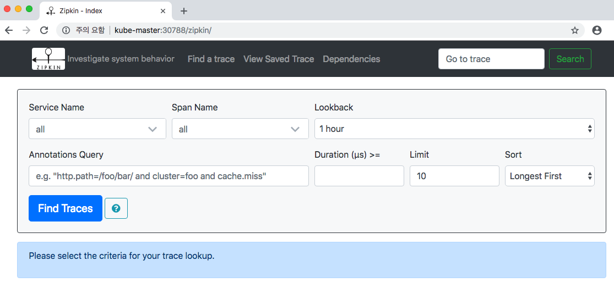

# K8s 환경에서 Zipkin 배포하기

MSA 환경에서는 하나의 클라이언트 호출이 내부적으로 여러 서비스를 거쳐 일어납니다. 서비스 개수가 점점 증가할수록 서비스 간 호출을 추적하고 어느 구간에서 지연이 발생하는지 확인하는 것은 매우 어렵습니다.  
Zipkin은 Sleuth의 TraceId, SpanId를 수집해서 서비스 간 트랜잭션을 시각적으로 보여줍니다.   

Zipkin은 데이터저장소가 연결되어있지 않으면 기본적으로 In-Memory를 사용하지만 데이터 영속성이 없기때문에 테스트 용도가 아니라면 Zipkin을 위한 별도의 데이터저장소(Cassandra, Elasticsearch 등)를 설치해주어야 합니다. 이 예제에서는 mysql을 사용하였습니다.

[Sleuth는 어떻게 TraceId, SpanId를 발급할까](https://github.com/SDSACT/coe-guide/blob/master/Log/Sleuth.md)
[Zipkin 클라이언트 라이브러리 종류](https://zipkin.io/pages/existing_instrumentations.html)
[Zipkin API](https://zipkin.io/zipkin-api/)

### Zipkin Server 배포
mySql에서 사용할 볼륨을 생성합니다.
(테스트를 위해 노드볼륨을 사용하지만 운영환경에서는 권장하지 않습니다)

```yaml
apiVersion: v1
kind: PersistentVolume
metadata:
  name: pv-zipkin-mysql
spec:
  capacity:
    storage: 5Gi
  accessModes:
  - ReadWriteOnce
  persistentVolumeReclaimPolicy: Retain
  storageClassName: local-mysql-storage
  local:
    path: /home/actmember/mysql/zipkin/data
  nodeAffinity:
    required:
      nodeSelectorTerms:
      - matchExpressions:
        - key: kubernetes.io/hostname
          operator: In
          values:
          - act-kube-03
---
apiVersion: v1
kind: PersistentVolumeClaim
metadata:
  name: mysql-data
spec:
  storageClassName: local-mysql-storage
  accessModes:
  - ReadWriteOnce
  resources:
    requests:
      storage: 100Mi
```

zipkin 서버와 mysql(위에서 만든 PVC를 사용)을 배포합니다.
```yaml
apiVersion: "v1"
kind: "List"
items:
- apiVersion: "v1"
  kind: "Service"
  metadata:
    labels:
      group: "zipkin"
    name: "zipkin"
  spec:
    ports:
    - port: 9411
      protocol: "TCP"
      targetPort: 9411
    selector:
      group: "zipkin"
    type: "LoadBalancer"
- apiVersion: "v1"
  kind: "Service"
  metadata:
    labels:
      group: "zipkin"
    name: "zipkin-mysql"
  spec:
    ports:
    - port: 3306
      protocol: "TCP"
      targetPort: 3306
    selector:
      group: "zipkin"
    type: "LoadBalancer"
- apiVersion: "v1"
  kind: "ConfigMap"
  metadata:
    labels:
      group: "zipkin"
    name: "zipkin-mysql-cnf"
  data:
    custom.cnf: "[mysqld]\nsql-mode=\"\"\n"
- apiVersion: "v1"
  kind: "ConfigMap"
  metadata:
    labels:
      group: "zipkin"
    name: "zipkin-mysql-initdb"
  data:
    init.sql: "CREATE TABLE IF NOT EXISTS zipkin_spans (\n  `trace_id` BIGINT NOT\
      \ NULL,\n  `id` BIGINT NOT NULL,\n  `name` VARCHAR(255) NOT NULL,\n  `parent_id`\
      \ BIGINT,\n  `debug` BIT(1),\n  `start_ts` BIGINT COMMENT 'Span.timestamp():\
      \ epoch micros used for endTs query and to implement TTL',\n  `duration` BIGINT\
      \ COMMENT 'Span.duration(): micros used for minDuration and maxDuration query'\n\
      ) ENGINE=InnoDB ROW_FORMAT=COMPRESSED;\n\nALTER TABLE zipkin_spans ADD UNIQUE\
      \ KEY(`trace_id`, `id`) COMMENT 'ignore insert on duplicate';\nALTER TABLE zipkin_spans\
      \ ADD INDEX(`trace_id`, `id`) COMMENT 'for joining with zipkin_annotations';\n\
      ALTER TABLE zipkin_spans ADD INDEX(`trace_id`) COMMENT 'for getTracesByIds';\n\
      ALTER TABLE zipkin_spans ADD INDEX(`name`) COMMENT 'for getTraces and getSpanNames';\n\
      ALTER TABLE zipkin_spans ADD INDEX(`start_ts`) COMMENT 'for getTraces ordering\
      \ and range';\n\nCREATE TABLE IF NOT EXISTS zipkin_annotations (\n  `trace_id`\
      \ BIGINT NOT NULL COMMENT 'coincides with zipkin_spans.trace_id',\n  `span_id`\
      \ BIGINT NOT NULL COMMENT 'coincides with zipkin_spans.id',\n  `a_key` VARCHAR(255)\
      \ NOT NULL COMMENT 'BinaryAnnotation.key or Annotation.value if type == -1',\n\
      \  `a_value` BLOB COMMENT 'BinaryAnnotation.value(), which must be smaller than\
      \ 64KB',\n  `a_type` INT NOT NULL COMMENT 'BinaryAnnotation.type() or -1 if\
      \ Annotation',\n  `a_timestamp` BIGINT COMMENT 'Used to implement TTL; Annotation.timestamp\
      \ or zipkin_spans.timestamp',\n  `endpoint_ipv4` INT COMMENT 'Null when Binary/Annotation.endpoint\
      \ is null',\n  `endpoint_ipv6` BINARY(16) COMMENT 'Null when Binary/Annotation.endpoint\
      \ is null, or no IPv6 address',\n  `endpoint_port` SMALLINT COMMENT 'Null when\
      \ Binary/Annotation.endpoint is null',\n  `endpoint_service_name` VARCHAR(255)\
      \ COMMENT 'Null when Binary/Annotation.endpoint is null'\n) ENGINE=InnoDB ROW_FORMAT=COMPRESSED;\n\
      \nALTER TABLE zipkin_annotations ADD UNIQUE KEY(`trace_id`, `span_id`, `a_key`,\
      \ `a_timestamp`) COMMENT 'Ignore insert on duplicate';\nALTER TABLE zipkin_annotations\
      \ ADD INDEX(`trace_id`, `span_id`) COMMENT 'for joining with zipkin_spans';\n\
      ALTER TABLE zipkin_annotations ADD INDEX(`trace_id`) COMMENT 'for getTraces/ByIds';\n\
      ALTER TABLE zipkin_annotations ADD INDEX(`endpoint_service_name`) COMMENT 'for\
      \ getTraces and getServiceNames';\nALTER TABLE zipkin_annotations ADD INDEX(`a_type`)\
      \ COMMENT 'for getTraces';\nALTER TABLE zipkin_annotations ADD INDEX(`a_key`)\
      \ COMMENT 'for getTraces';\n\nCREATE TABLE IF NOT EXISTS zipkin_dependencies\
      \ (\n  `day` DATE NOT NULL,\n  `parent` VARCHAR(255) NOT NULL,\n  `child` VARCHAR(255)\
      \ NOT NULL,\n  `call_count` BIGINT\n) ENGINE=InnoDB ROW_FORMAT=COMPRESSED;\n\
      \nALTER TABLE zipkin_dependencies ADD UNIQUE KEY(`day`, `parent`, `child`);\n\
      GRANT SELECT, INSERT, UPDATE, DELETE ON zipkin.* TO zipkin@'%' IDENTIFIED BY\
      \ 'zipkin' WITH GRANT OPTION ;\nFLUSH PRIVILEGES;\n"
- apiVersion: "extensions/v1beta1"
  kind: "Deployment"
  metadata:
    labels:
      group: "zipkin"
    name: "zipkin"
  spec:
    replicas: 1
    selector:
      matchLabels:
        group: "zipkin"
    template:
      metadata:
        labels:
          group: "zipkin"
      spec:
        containers:
        - env:
          - name: "STORAGE_PORT_9042_TCP_ADDR"
            value: "zipkin-cassandra:9411"
          - name: "STORAGE_PORT_3306_TCP_ADDR"
            value: "zipkin-mysql:3306"
          - name: "STORAGE_TYPE"
            value: "mysql"
          - name: "TRANSPORT_TYPE"
            value: "http"
          - name: "KUBERNETES_NAMESPACE"
            valueFrom:
              fieldRef:
                fieldPath: "metadata.namespace"
          image: "openzipkin/zipkin:latest"
          name: "zipkin"
          readinessProbe:
            httpGet:
              path: "/api/v2/services"
              port: 9411
            initialDelaySeconds: 5
          resources:
            limits:
              cpu: "0"
              memory: "0"
            requests:
              cpu: "0"
              memory: "0"
- apiVersion: "extensions/v1beta1"
  kind: "Deployment"
  metadata:
    labels:
      group: "zipkin"
    name: "zipkin-mysql"
  spec:
    replicas: 1
    selector:
      matchLabels:
        group: "zipkin"
    template:
      metadata:
        labels:
          group: "zipkin"
      spec:
        containers:
        - env:
          - name: "MYSQL_USER"
            value: "zipkin"
          - name: "MYSQL_PASSWORD"
            value: "zipkin"
          - name: "MYSQL_ROOT_PASSWORD"
            value: "zipkin"
          - name: "MYSQL_DATABASE"
            value: "zipkin"
          - name: "KUBERNETES_NAMESPACE"
            valueFrom:
              fieldRef:
                fieldPath: "metadata.namespace"
          image: "mysql:5.7"
          name: "zipkin-mysql"
          readinessProbe:
            initialDelaySeconds: 5
            tcpSocket:
              port: 3306
          resources:
            limits:
              cpu: "0"
              memory: "0"
            requests:
              cpu: "0"
              memory: "0"
          volumeMounts:
          - mountPath: "/var/lib/mysql"
            name: "mysql-data"
          - mountPath: "/docker-entrypoint-initdb.d/"
            name: "mysql-init-script"
          - mountPath: "/etc/mysql/conf.d/"
            name: "mysql-confd"
        volumes:
        - name: "mysql-data"
          persistentVolumeClaim:
            claimName: "mysql-data"
        - configMap:
            name: "zipkin-mysql-initdb"
          name: "mysql-init-script"
        - configMap:
            name: "zipkin-mysql-cnf"
          name: "mysql-confd"
```

K8s 리소스 생성 후 아래와 같이 레이블을 통해 상태를 확인할 수 있습니다.

```sh
$ kubectl get all -l group=zipkin

NAME                               READY     STATUS    RESTARTS   AGE
pod/zipkin-587bc5b578-96p8h        1/1       Running   0          2h
pod/zipkin-mysql-cc58858cd-n7h9t   1/1       Running   0          1d

NAME                   TYPE           CLUSTER-IP      EXTERNAL-IP   PORT(S)          AGE
service/zipkin         LoadBalancer   X.X.X.X         <pending>     9411:30788/TCP   1d
service/zipkin-mysql   LoadBalancer   X.X.X.X         <pending>     3306:32499/TCP   1d

NAME                           DESIRED   CURRENT   UP-TO-DATE   AVAILABLE   AGE
deployment.apps/zipkin         1         1         1            1           1d
deployment.apps/zipkin-mysql   1         1         1            1           1d

NAME                                     DESIRED   CURRENT   READY     AGE
replicaset.apps/zipkin-587bc5b578        1         1         1         2h
replicaset.apps/zipkin-mysql-cc58858cd   1         1         1         1d
```


zipkin 서비스의 외부포트를 통해 Zipkin UI에 접속합니다.  



## Zipkin Client
Spring Boot 프로젝트에 Zipkin 클라이언트 라이브러리를 추가하여 Zipkin 서버로 데이터를 전송하겠습니다.

### Dependency 추가
```gradle
dependencies {
    ...
    compile('org.springframework.cloud:spring-cloud-starter-sleuth')
    compile('org.springframework.cloud:spring-cloud-starter-zipkin')
    ...
```
### 프러퍼티 파일 추가
```yaml
spring:
  zipkin:
    base-url: http://kube-master:30788/ # zipkin 서버 url
  sleuth:
    sampler:
      percentage: 1.0 # Sleuth 샘플링 비율 (1.0 = 100%)
```

프로젝트를 재시작한 후, 테스트를 위해 프로젝트의 Controller에 명시 된 API를 호출합니다.   
호출이 완료되면 아래와 같이 Zipkin 서버의 API를 호출하여(/api/v2/spans) 서버로 데이터를 전송하는 로그를 확인할 수 있습니다.
```
2018-10-17 15:04:28.998 DEBUG [sample-service,,,] 52211 --- [ender@15186ce0}] o.s.c.s.z.s.ZipkinRestTemplateWrapper    : Created POST request for "http://kube-master:30788/api/v2/spans"
2018-10-17 15:04:28.998 DEBUG [sample-service,,,] 52211 --- [ender@15186ce0}] o.s.c.s.z.s.ZipkinRestTemplateWrapper    : Setting request Accept header to [text/plain, application/json, application/*+json, */*]
2018-10-17 15:04:28.998 DEBUG [sample-service,,,] 52211 --- [ender@15186ce0}] o.s.c.s.z.s.ZipkinRestTemplateWrapper    : Writing [[B@79ca5d29] as "application/json" using [org.springframework.http.converter.ByteArrayHttpMessageConverter@28078f47]
2018-10-17 15:04:29.000 DEBUG [sample-service,,,] 52211 --- [ender@15186ce0}] s.n.www.protocol.http.HttpURLConnection  : sun.net.www.MessageHeader@1719f4607 pairs: {POST /api/v2/spans HTTP/1.1: null}{Accept: text/plain, application/json, application/*+json, */*}{Content-Type: application/json}{User-Agent: Java/1.8.0_172}{Host: kube-master:30788}{Connection: keep-alive}{Content-Length: 479}
2018-10-17 15:04:29.003 DEBUG [sample-service,,,] 52211 --- [ender@15186ce0}] s.n.www.protocol.http.HttpURLConnection  : sun.net.www.MessageHeader@5fca3e885 pairs: {null: HTTP/1.1 202 Accepted}{Connection: keep-alive}{vary: origin}{Content-Length: 0}{Date: Wed, 17 Oct 2018 06:04:28 GMT}
2018-10-17 15:04:29.003 DEBUG [sample-service,,,] 52211 --- [ender@15186ce0}] o.s.c.s.z.s.ZipkinRestTemplateWrapper    : POST request for "http://kube-master:30788/api/v2/spans" resulted in 202 (Accepted)   
```
