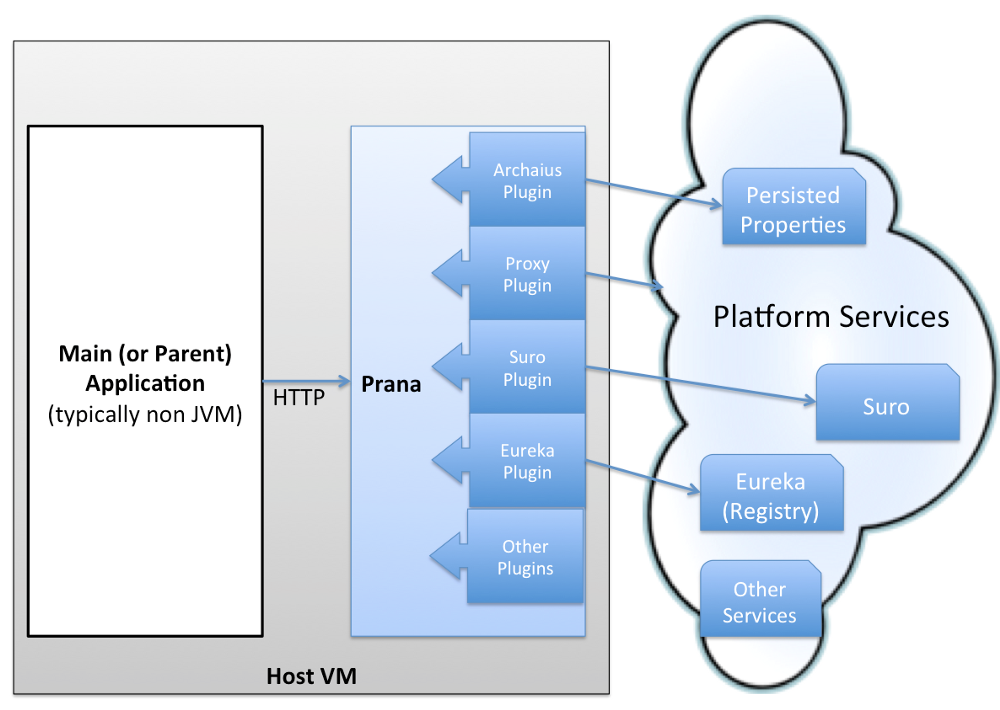

# Neflix Sidecar

### Prana
Netflix PaaS 생태계를 구성하는 라이브러리들의 대부분이 Java로 구현돼 있기 때문에 non-Java 서비스들을 위한 Polyglot 경을 위해 Netflix에서 Prana Sidecar를 사용합니다.

Prana 기능
- Eureka Registration
- Service discovery
- Dynamic Properties
- Proxy
- Healthcheck
- Admin UI

### Spring Cloud Netflix Sidecar
Netflix Prana로 부터 영향을 받은 Spring Cloud Netflix Sidecar는 non-JVM 서비스들이 Eureka, Ribbon, Config Server를 사용할 수 있도록 합니다.

Neflix Sidecar 기능
- service discovery : host:port/ 를 통하여 다른 방법에 비해 편하게 Non-JVM 어플리케이션에서 다른 Eureka 클라이언트를 찾을 수 있다.
- monitoring : health check uri 설정을 통해 Eureka서버에서 Non-JVM 어플리케이션의 동작 여부를 알수 있다.
- routing / proxying : Zuul을 통하여 Request를 받을 수 있다.
- balancing : 내장된 Ribbon을 통해 Client side load balancing 기능을 지원 한다.
- counfiguration : Spring Cloud Config를 통하여 configuration properties를 받을 수 있다.
