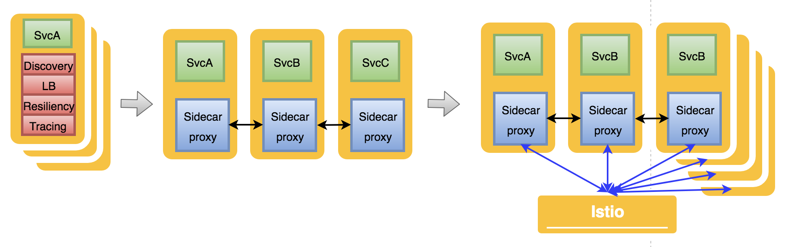
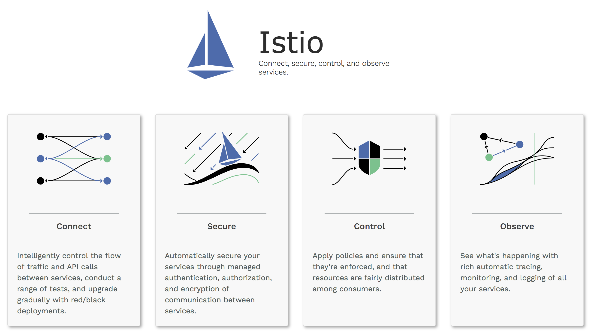

# Service Mesh
Microservice Architecture에서는 수 많은 서비스들의 인스턴가 동적으로 올라오고 사라집니다.  
또한 Monolitic Architecture에서 프로세스나 쓰레드와 같은 인스턴스 내부에서 처리하던 기능들이 MSA 환경에선 서비스 간 통신을 통해서 데이터를 처리합니다.   
이러한 복잡한 상황에서 **내부 네트워크를 안정적으로 유지** 하기 위해 Service Mesh라는 개념이 필요하게 되었습니다.  
Service Mesh는 Infrastructure Layer로 서비스 간 통신을 빠르고 신뢰할 수 있게 만들어 줍니다.     

Service Mesh
- Security
- Resiliency(timeout, retires, circuit breaker)
- Observability
- Routing control

## Service Mesh 구현

### 1. 라이브러리 방식
Service Mesh의 초기 모델은 각 서비스마다 공통적으로 적용되는 라이브러리(Netflix OSS의 대부분)를 import 하는 방식이었습니다.  
하지만 라이브러리화는 서비스 간 통신에 대한 로직을 서비스 내부에서 관리하기 때문에 Application code에 종속성이 생기고 아래와 같은 이슈가 발생합니다.  
- 개발자가 비즈니스 로직에 집중하기 어렵게 만들고 통신 오류가 발생하였을 때 원인 파악이 어려움    
- 라이브러리 버전 변경이나 자체 버그로 인한 주요 서비스 영향  
- 라이브러리 언어에 종속되어 polyglot 구현이 어려움  

### 2. Sidecar Proxy 적용
  

각 서비스에 Sidecar Proxy를 적용하여 마이크로서비스간 요청이 해당 proxy를 통해 라우팅되도록 합니다.  
이때 Sidecar Proxy는 Application code 내부에 들어가는 것이 아니라  
서비스와 분리되어 실행되기 때문에 비즈니스 로직과 네트워크 관련 로직을 분리할 수 있습니다.  
이 경량화 Proxy에는 Routing rule, Circuit Breaker, 모니터링 등의 공통 기능을 적용하게 됩니다.

### 3. Service Mesh paltform
마이크로 서비스의 Sidecar Proxy들을 개별적으로 관리하기 어려워서   
이 Proxy를 통해 **마이크로 서비스 전체를 관리** 하기 위한 아래와 같은 Service Mesh Platform들이 나왔습니다.

- **Istio** by Google, IBM, Lyft
- **linkerd**, **conduit** by Buoyant  

이러한 플랫폼은 개별 Sidecar Proxy들의 network traffic을 관리하거나 metrics 수집 등의 기능을 합니다.
참고) http://philcalcado.com/2017/08/03/pattern_service_mesh.html

### * Service Meshes
  

# Service Mesh platform - istio

Miscroservices들의 network를 관리하기 위한 platform  
Netflix OSS와는 다르게 **소스 코드 변경 없고, Java App이 아니더라도** 서비스 가능(Sidecar pattern)  
yaml 설정 파일을 생성하여 API로 호출하여 적용하는 방식  
  

각 서비스에서 발생하는 모든 network traffic을  
envoy같은 sidecar proxy를 통해 istio가 수집하고 분석하여 service mesh를 지원   
현재 Kubernetes를 통한 사용이 가능하고, Eureka에 등록 된 서비스들도 지원 가능

> Lyft's envoy 사용으로  
> Dynamic routing, service discovery, load balancing, TLS termination, gRPC 사용 가능  

## 1. Architecture
- Control plane  
  Proxy를 관리하고 Mixer를 통해 서비스들의 telemetry를 관리    
- Data plane(proxy)  
  Sidecar pattern으로 서비스에 포함되며 App 서비스들간의 모든 통신 및 Control plane과의 통신을 제어

    

  #### Mixer
  Access control, usage policies를 proxy를 통해 적용하고 telemetry를 수집 함

  #### Pilot   
  sidecar proxy를 관리하고  
  아래 기능을 제공하기 위해 정의된 rule을 proxy로 배포  

  - Service discovery for envoys  
  - Dynamic routing table update
  - load balancing pool update
  - Resiliency(timeout, retires, circuit breakers)   

      

  #### Citadel  
  service간의 통신이나 end-user 사이에 자체 credential을 이용한 인증 기능을 제공 함

  #### Proxy(Envoy)
  서비스들의 모든 트래픽에 관여하여 service mesh 구성을 지원하기 위해 아래 기능을 제공  
  - service discovery  
  - load balancing  
  - TLS termination
  - HTTP/2 & gRPC proxying  
  - circuit breakers  
  - health checks
  - staged rollouts with %-based traffic split  
  - fault injection and rich metrics
  - monitoring metric 제공     
  - 자체 application instance pool 갖고 health check 수행  

## 2. 주요기능

### A. Traffic Management  
#### Discovery and Load Balancing
Kubenetes같은 플랫폼을 통해 서비스가 등록되고,  
이를 Envoy가 discover하고 [loadbalancing] 하며 접근 함   
> Envoy를 통한 loadbalancing 설정 [참고](https://github.com/SDSACT/sidecar-pattern/blob/master/istio_gateway.md#destinationrule)

  

#### Ingress and egress
내부 서비스 통신 외에 외부 서비스 API 호출도 envoy를 통해 할 수 있음  
이 경우 외부 API에도 Resiliency(timeout, retires, circuit breakers) 적용 가능  

  

#### Communication between services
서비스 A는 envoy의 routing rule에 따라 서비스 B를 호출 함  
svcA 자체는 다른 서비스에 대한 정보를 별도로 포함하거나 관리하지 않음  

  

```yaml
apiVersion: networking.istio.io/v1alpha3
kind: VirtualService
metadata:
  name: serviceB-vs
spec:
  hosts:
  - serviceB
  http:
  - route:
    - destination:
        host: serviceB
        subset: v1
     weight: 99
    - destination:
        host: serviceB
        subset: v2        
     weight: 1
```
> VirtualService가 Dynamic Routing 설정을 위해 사용 됨  

#### Handling failure(by envoy)
- timeouts
- retires
- 통시 접속 connections 수 제한
- health check
- circuit breakers    

```yaml
apiVersion: networking.istio.io/v1alpha3
kind: DestinationRule
metadata:
  name: ServiceA
spec:
  host: ServiceA
  trafficPolicy:
    connectionPool:
      tcp:
        maxConnections: 1
      http:
        http1MaxPendingRequests: 1
        maxRequestsPerConnection: 1
    outlierDetection:
      consecutiveErrors: 1
      interval: 1s
      baseEjectionTime: 3m
      maxEjectionPercent: 100
```

> DestionationRule에 failure 관련 설정 하게 됨  
> circuit open 되는 경우 503에러 코드를 return 하고, 이를 Client에서 에러 처리 해야 함  

#### mirroring
모든 live 트래픽을 mirroring하여 다른 서비스로 전송
이에 대한 response는 없음
```yaml
apiVersion: networking.istio.io/v1alpha3
kind: VirtualService
metadata:
  name: httpbin
spec:
  hosts:
    - httpbin
  http:
  - route:
    - destination:
        host: httpbin
        subset: v1
      weight: 100
    mirror:
      host: httpbin
      subset: v2
```
> httpbin v1 서비스로 모든 요청을 전송하며, v2로도 mirroring된 트래픽을 전송

#### Fault injection
서비스를 죽이지 않고, 일부러 fault를 발생하여 다양한 테스트 가능  

```yaml
apiVersion: networking.istio.io/v1alpha3
kind: VirtualService
metadata:
  name: ratings
spec:
  hosts:
  - ratings
  http:
  - match:
    - headers:
        end-user:
          exact: jason
    fault:
      delay:
        percent: 100
        fixedDelay: 7s
    route:
    - destination:
        host: ratings
        subset: v1
```        
> header에 jason이 포함 된 경우 7초간 지연 후 라우팅 되게 함  

### B. Gateway
[Istio Gateway 설명 참고](
https://github.com/SDSACT/sidecar-pattern/blob/master/istio_gateway.md)

### C. Security
App 서비스들을 고유하게 관리하고 서비스들 간의 통신을 보호  

TBD  

### D. Policies and Telemetry
서비스 정책 rule을 범용 적용 가능  
서비스들간의 의존도 및 상태를 모니터링 하기 위한 Metric 제공  

TBD  

## 3. Rule configuration
Virtual service에 Istio service mesh에서 서비스간에 어떻게 요청을 처리할지 정의 함  
[참고]https://istio.io/docs/concepts/traffic-management/rules-configuration/

TBD

출처 https://istio.io/


## Netflix OSS와의 비교

|                       | Netflix OSS   | Istio over Kubernetes |
|-----------------------|---------------|-----------------------|
| Service Discovery     | Eureka        | Kubernetes DNS        |
| Client  LoadBalancing | Ribbon        | Envoy proxy           |
| Gateway               | Zuul          | Istio gateway         |
| Circuit Breaker       | Hystrix       | Envoy proxy           |
| Config                | Config Server | Kubernetes Config Map |

Metric  

|                       | ??? | Istio over Kubernetes |
|-----------------------|---------------|-----------------------|
| Tracing               | Zipkin        | Zipkin, Jagger        |
| Logging               | EFK           | EFK                   |
| Telemetry               | ???           | Prometheus                   |
| etc..                 | Feign         | ???                   |


일정

금주 조사  ~ 7/27  
2주후 까지 구현  7/30 ~ 8/17  
1주후 DEP 구성을 위한 DEP 현황 공유 8월초    
3 or 4주 후 부터 DEP POC 8/20 ~ 9/7  
정리 및 보고 9/10 ~ 9/12  

Bookinfo 샘플 프로젝트 :   
https://istio.io/docs/examples/bookinfo/  
http://192.168.10.77:31380/productpage

192.168.10.77 마스터 actmember@jeep8walrus  
192.168.20.230 미니언1  
192.168.30.194 미니언2  
