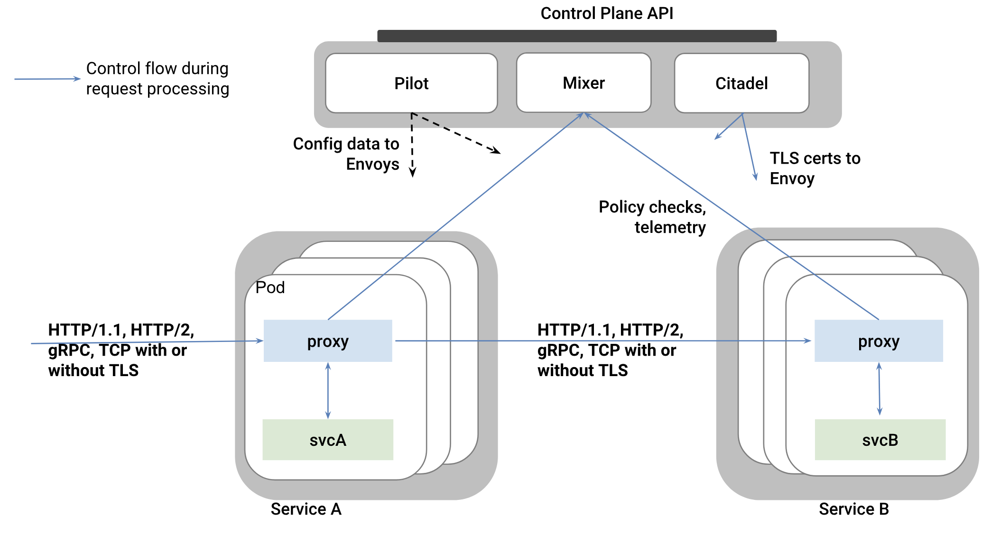
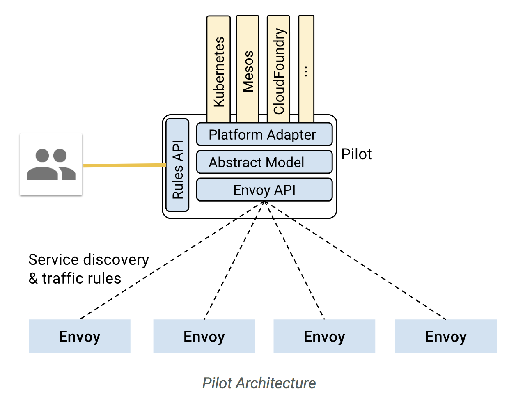
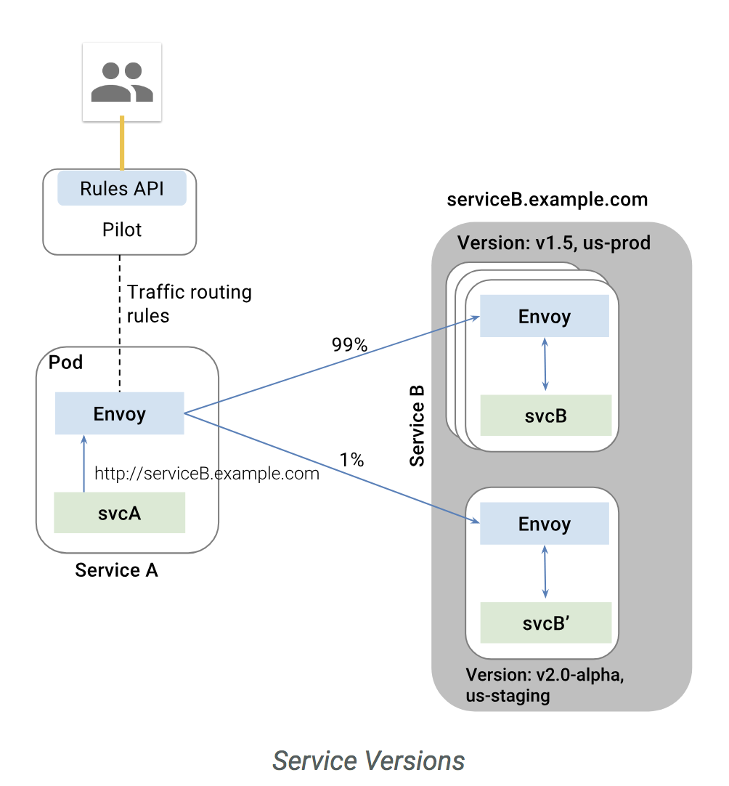
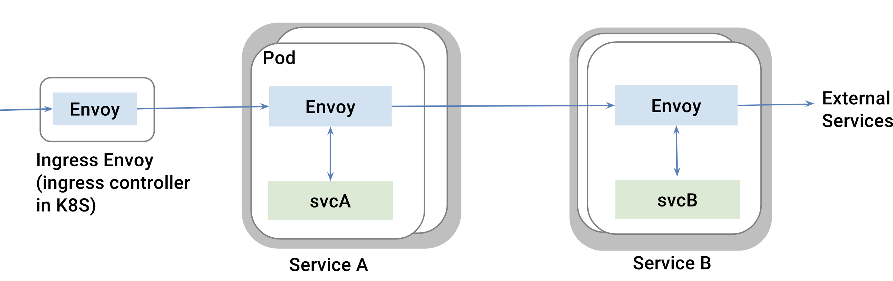
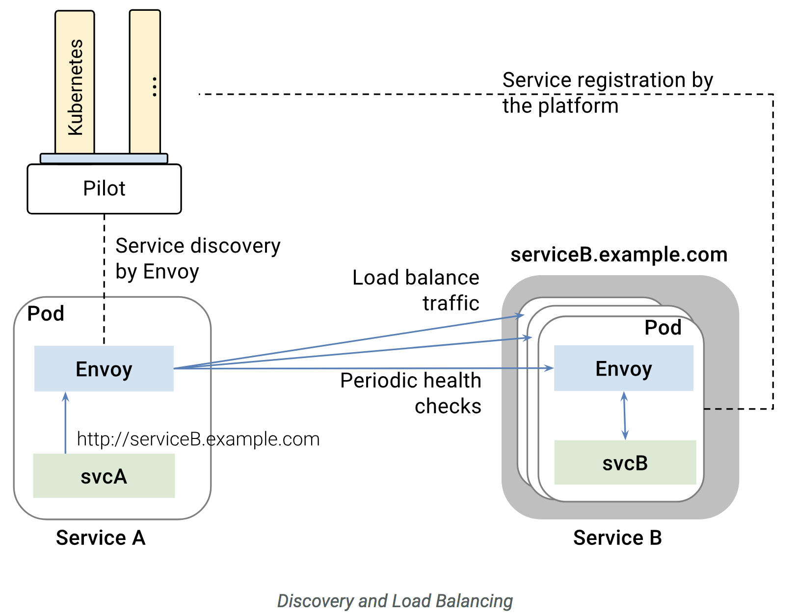

# Istio
Miscroservices들의 network(Serivce Mesh)를 관리하기 위한 platform  
Netflix OSS와는 다르게 **소스 코드 변경 없고, Java App이 아니더라도** 아래 기능에 대한 지원이 가능(Sidecar pattern)
- Service discovery
- Load balancing
- failure recovery
- rate limiting
- Service authentication
- Monitoring  

각 서비스에서 발생하는 모든 network traffic을  
envoy같은 sidecar proxy를 통해 istio가
수집하고 분석하여 service mesh를 지원  
현재 Kubernetes를 통한 사용이 가능하고, Eureka에 등록 된 서비스들도 지원 가능  

> Lyft's envoy 사용으로  
> Dynamic routing, service discovery, load balancing, TLS termination, gRPC 사용 가능  

## 1. Architecture
- Control plane  
  Proxy를 관리하고 Mixer롤 통해 서비스들의 telemetry를 관리    
- Data plane(proxy)  
  Sidecar pattern으로 서비스에 포함되며 App 서비스들간의 모든 통신 및 Control plane과의 통신을 제어

  

#### Envoy
서비스들의 모든 트래픽에 관여하여 service mesh 구성을 지원하기 위해 아래 기능을 제공  
- service discovery  
- load balancing  
- TLS termination
- HTTP/2 & gRPC proxying  
- circuit breakers  
- health checks
- staged rollouts with %-based traffic split  
- fault injection and rich metrics
- monitoring metric 제공     
- 자체 application instance pool 갖고 health check 수행  

#### Mixer
Access control, usage policies를 proxy를 통해 적용하고 telemetry를 수집 함

#### Pilot   
sidecar proxy를 관리하고  
아래 기능을 제공하기 위해 정의된 rule을 proxy로 배포  

- Service discovery for envoys  
- Dynamic routing table update
- load balancing pool update
- Resiliency(timeout, retires, circuit breakers)   

    

#### Citadel  
service간의 통신이나 end-user 사이에 자체 credential을 이용한 인증 기능을 제공 함

## 2. 주요기능
### A. Traffic Management  
#### Communication between services
서비스 A는 envoy의 routing rule에 따라 서비스 B를 호출 함  
서비스 A는 다른 서비스에 대한 정보를 별도로 포함하거나 관리하지 않음  

  

#### Ingress and egress
내부 서비스 통신 외에 외부 서비스 API 호출도 envoy를 통해 할 수 있음  
이 경우 외부 API에도 Resiliency(timeout, retires, circuit breakers) 적용 가능  

  

#### Discovery and Load Balancing
Kubenetes같은 플랫폼을 통해 서비스가 등록되고,  
이를 Envoy가 discover하고 loadbalancing 하며 접근 함   

  

#### 기타
- Handling failure(by envoy)
  - timeouts
  - retires
  - 통시 접속 connections 수 제한
  - health check
  - circuit breakers
- Fault injection
  - 서비스를 죽이지 않고, 일부러 fault를 발생하여 다양한 테스트 가능  

### B. Security
App 서비스들을 고유하게 관리하고 서비스들 간의 통신을 보호  

TDB  

### C. Policies and Telemetry
서비스 정책 rule을 범용 적용 가능  
서비스들간의 의존도 및 상태를 모니터링 하기 위한 Metric 제공  

TDB  

## 3. Rule configuration
Virtual service에 Istio service mesh에서 서비스간에 어떻게 요청을 처리할지 정의 함  
[참고]https://istio.io/docs/concepts/traffic-management/rules-configuration/

TBD

출처 https://istio.io/
