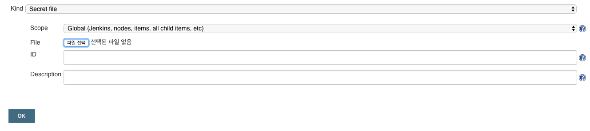
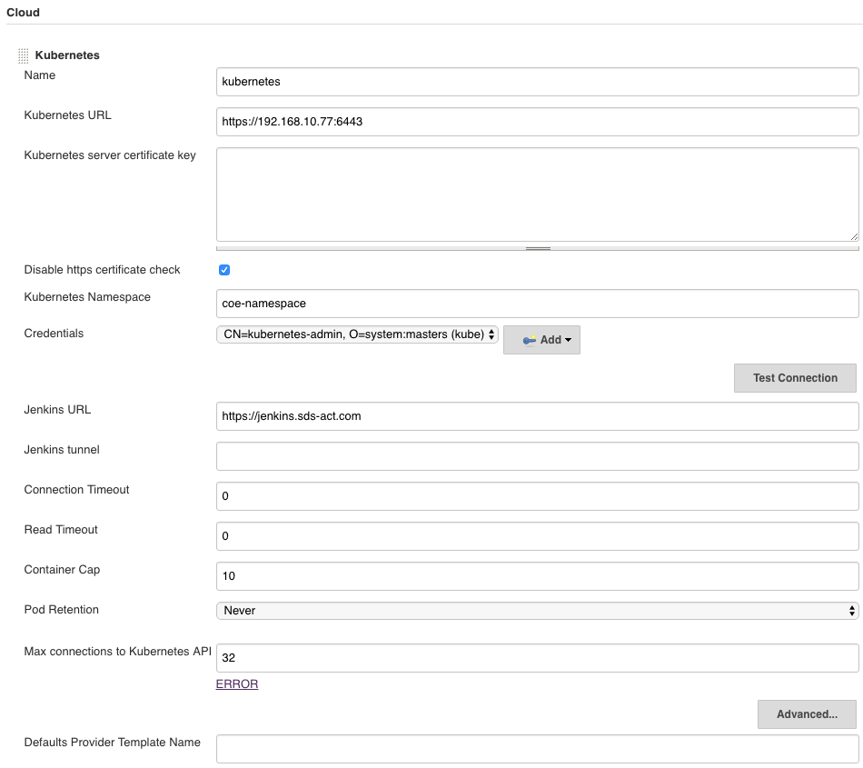
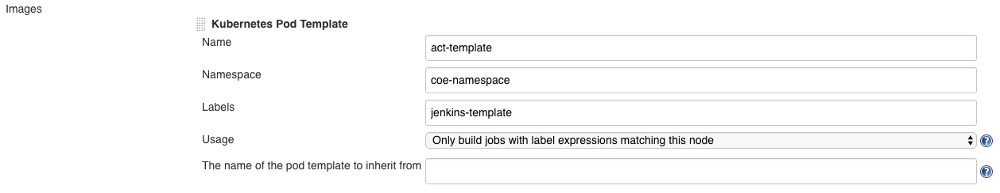
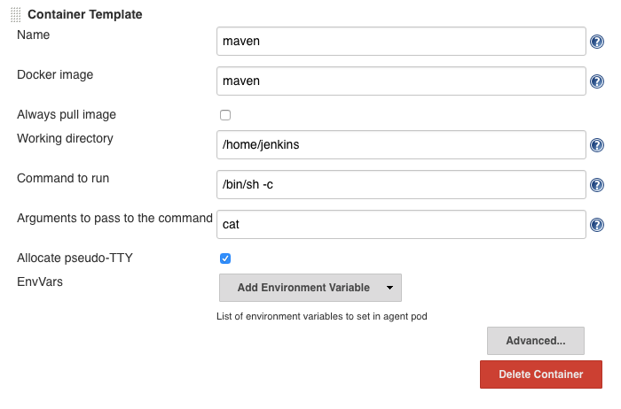
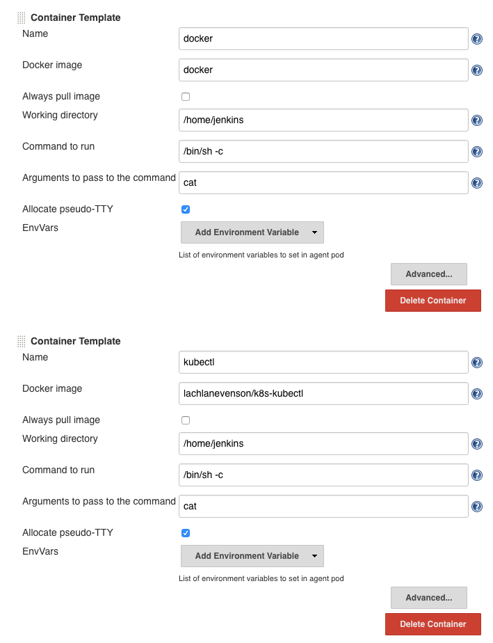
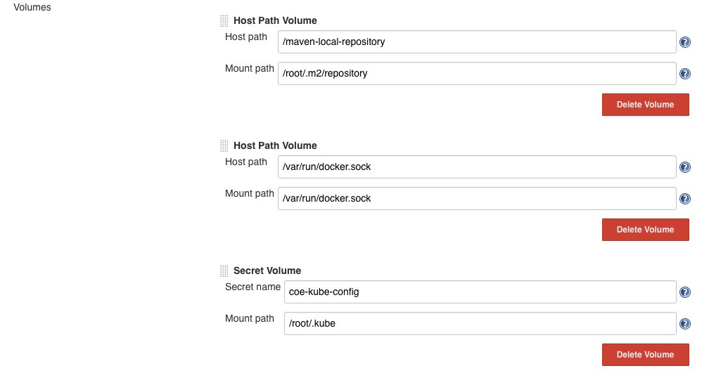
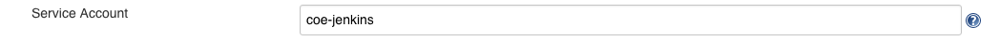

# Jenkins

Jenkins에서 Kubernetes로의 배포 방법을 설명합니다.
1. [Jenkins Kubernetes Plugins](https://github.com/SDSACT/coe-kubernetes/blob/master/CICD/kubernetes_deploy.md#jenkins-kubernetes-plugin) : Agent를 Kubernetes 서버 내에서 실행    
2. [Jenkins SSH to Kubernetes](https://github.com/SDSACT/coe-kubernetes/blob/master/CICD/kubernetes_deploy.md#deploy-with-ssh) : Jenkins 서버에서 Docker Agent를 실행하여 Kubernetes 서버로 SSH 접속하여 명령어 실행
3. [Kubernetes Continuous Deploy Plugin](https://github.com/SDSACT/coe-kubernetes/blob/master/CICD/kubernetes_deploy.md#kubernetes-continuous-deploy-plugin) : Jenkins 서버에서 Docker Agent를 실행하여 Kubernetes 서버로 SSH 접속하여 명령어 실행

## Jenkins Kubernetes Plugin

Jenkins의 Kubernetes Plugin을 통해 agent를 Kubernetes 서버 내의 Pod으로 실행시킵니다.   
배포 파이프라인은 아래와 같습니다.  
~~~text
- Cloning Git
- Build Project
- Build Image
- Push Image : private repository에 생성한 image를 push
- Kubernetes Deploy : kubectl 명령어로 Deployment 생성 또는 이미지 교체
~~~


1. Jenkins Plugin 설치
Jenkins > Manage Jenkins > Manage Plugins
 - docker
 - Kubernetes


2. Jenkins Credential 설정  
Pipeline Script에서 사용할 인증 정보를 추가해 줍니다.
Jenkins > Credentials > System > Global or added domain > Add Credentails에 인증 정보를 먼저 추가해 줍니다.  
 - git clone을 위한 인증정보를 등록하여 Script에서 아래와 같이 credentialsId(예제는 coe-github)를 사용합니다.  
   ```sh
   steps {
        git credentialsId: 'coe-github', url: 'https://github.com/SDSACT/coe-eureka.git'
      }
   ```
 - private docker registry에 image를 푸시하기 위한 인증정보를 등록하여(예제는 dockeruser로 등록 함) Script에서 아래와 같이 credentialsId(예제는 dockeruser)를 사용합니다.
   ```sh
   docker.withRegistry('https://docker.sds-act.com', 'dockeruser' ) {
        dockerImage.push()
   }
   ```
 - kubernetes 를 사용하기 위한 key 파일 생성 및 credential 등록  
     * ~/.kube/config 파일에서 certificate-authority-data 의 값을 이용하여 ca.crt 생성 (쿠버네티스 서버 certificate key)
      ~~~bash
      $ echo [certificate-authority-data 내용] | base64 -d > ca.crt
      ~~~

     * ~/.kube/config 파일에서 client-certificate-data 의 값을 이용하여 client.crt 생성
      ~~~bash
      $ echo [client-certificate-data 내용] | base64 -d > client.crt
      ~~~

     * ~/.kube/config 파일에서 client-key-data 의 값을 이용하여 client.key 생성
     ~~~bash
     $ echo [client-key-data 내용] | base64 -d > client.key
     ~~~

     * 위 파일들을 이용하여 pfx 파일 생성
     ~~~bash
     $ openssl pkcs12 -export -out cert.pfx -inkey client.key -in client.crt -certfile ca.crt
     ~~~

     * 생성 된 파일을 jenkins Credential에 등록

     


3. Kubernetes Secret 설정  

  - kubernetes에서 private docker registry로 접근을 위한 Secret 설정
    ```sh
    $ kubectl create secret docker-registry coe-registry-key -n coe-namespace --docker-server=https://docker.sds-act.com --docker-username=dockeruser --docker-password=yourPassword
    ```
    Secret을 Serviceaccount에 적용
    ```sh
    $ kubectl patch serviceaccount default -n coe-namespace -p '{"imagePullSecrets": [{"name": "coe-registry-key"}]}'
    ```

  - Agent에서 마스터의 설정을 바라보기 위한 Kube config secret 생성
    ```sh
    $ kubectl create secret -n coe-namespace generic coe-kube-config --from-file=$HOME/.kube/config
    ```

4. Jenkins Kubernetes 설정 정보 추가  
  Jenkins > configuration > Cloud > Kubernetes

  
    

  - Kubernetes Namespace : Agent가 접속할 namespace
  - Credentials : 2번에서 생성한 Kubernetes credential  

  Kubernetes Pod Template
  - Namespace : Agent Pod이 실행 될 Namespace
  - Labels : Script에서 해당 Pod Template을 참조하기 위한 레이블  

    
      
  - Agent Pod에 실행 될 Container 이미지 정보 설정 (maven, docker, kubectl)

    
    

  Volumes(Kubernetes Host 서버의 볼륨을 Agent에 마운트)
   - /maven-local-repository : maven repository를 Kubernetes Host 서버의 경로로 설정 (Agent에서 빌드할 때마다 라이브러리를 다시 받아오지 않도록 하기 위해서)   
   - /var/run/docker.sock : Docker In Docker인 경우 이므로 Agent가 Kubernetes Host의 도커 소켓을 사용하도록 설정   
   - coe-kube-config : 3번에서 설정한 Kube config secret을 Agent로 마운트     


5. coe-jenkins 를 위한 ClusterRole 생성

  아래와 같은 내용으로 coe-jenkins-clusterrole.yaml 생성
  ```yaml
  kind: ClusterRole
  apiVersion: rbac.authorization.k8s.io/v1
  metadata:
    name: coe-jenkins-clusterrole
  rules:
  - apiGroups: ["*"]
    resources: ["deployments"]
    verbs: ["get", "watch", "list","create","update","patch"]
  ```

  ~~~bash
  $ kubectl apply -f [위 파일명]
  ~~~

6. coe-jenkins agent가 실행될 namespace와 권한을 가진 ServiceAccount 생성(위의 ClusterRole과 바인딩)

  ~~~yaml
  # jenkins-role-script.yaml
  --
  apiVersion: v1
  kind: Namespace
  metadata:
    name: coe-namespace
  ---
  apiVersion: v1
  kind: ServiceAccount
  metadata:
    namespace: coe-namespace
    name: coe-jenkins
  ---
  kind: ClusterRoleBinding
  apiVersion: rbac.authorization.k8s.io/v1
  metadata:
    name: coe-jenkins-clusterrolebinding
  subjects:
    - kind: ServiceAccount
      name: coe-jenkins
      namespace: coe-namespace
    - kind: ServiceAccount
      name: default
      namespace: coe-namespace
  roleRef:
      apiGroup: rbac.authorization.k8s.io
      kind: ClusterRole
      name: coe-jenkins-clusterrole
  ---
  ~~~

  ~~~bash
  $ kubectl apply -f jenkins-role-script.yaml
  ~~~

7. Jenkins Pipeline script 작성
~~~sh
pipeline {
  agent {label 'jenkins-template'}

  environment {
    registry = "docker.sds-act.com/eureka-test"
    dockerImage = ''
    buildnum = ''
  }

  stages {

    stage('Cloning Git') {
      steps {
        git credentialsId: 'coe-github', url: 'https://github.com/SDSACT/coe-eureka.git'
      }
    }    
    stage('Build Project') {
      steps {
        container('maven') {
            script{
                sh "mvn clean install -Dprofile=kube -DskipTests=true"
            }
        }
      }
    }
    stage('Building image') {
      steps{
        container('docker') {
            script {
              buildnum = '${BUILD_NUMBER}'
              dockerImage = docker.build registry + ":" + buildnum
            }
        }
      }
    }
    stage('Deploy Image') {
      steps{
        container('docker') {        
            script {
              docker.withRegistry('https://docker.sds-act.com', 'dockeruser' ) {
                dockerImage.push()
              }
            }
        }
      }
    }
    stage('Kube Deploy') {
      steps{
        container('kubectl') {   
          script {
            try{
                sh ('kubectl get deploy/eureka-test -n coe-namespace')
                sh ('kubectl set image deploy/eureka-test -n coe-namespace eureka-test=docker.sds-act.com/eureka-test:' + buildnum)
            }
            catch(err) {
                sh ('kubectl run eureka-test --env="SPRING_PROFILES_ACTIVE=kube" --image=docker.sds-act.com/eureka-test:'+ buildnum)
            }
          }
        }
      }
    }
  }
}
~~~


## Deploy with SSH

Jenkins 호스트 서버에서 docker agent를 실행시키고  
agent에서 Kubernetes 서버에 ssh로 직접 접속하여 배포하는 방법입니다.
> docker agent에서 docker 사용을 위해  
> jenkins-slave-jdk-maven-git 이미지에 docker를 설치하여 임의 이미지를 생성하였습니다.  

1. Jenkins Plugin 설치
 - docker
 - ssh agent

2. Jenkins Credential 설정
Pipeline에서 사용할 인증 정보를 추가해 줍니다.
  - git clone 시 사용할 인증 정보를 등록하여 Pipeline 구성 시 아래와 같이 credentialsId(예제는 dockeruser)를 사용합니다.  
    ```sh
    steps {
         git credentialsId: 'coe-github', url: 'https://github.com/SDSACT/coe-eureka.git'
       }
    ```
  - private docker registry에 image를 푸시하기 위한 인증정보를 등록하여(예제는 dockeruser로 등록 함) Pipeline구성 시 아래와 같이 credentialsId(예제는 dockeruser)를 사용합니다.
    ```sh
    docker.withRegistry('https://docker.sds-act.com', 'dockeruser' ) {
         dockerImage.push()
    }
    ```

3. Kubernetes Secret 설정
Kubernetes 서버에서 Private docker registry로 부터 이미지를 pull 하기 위해 Secret 오브젝트를 생성하고  
default Serviceaccount에 적용해 줍니다.

  ```sh
  $ kubectl create secret docker-registry actregistrykey --docker-server=https://docker.sds-act.com --docker-username=dockeruser --docker-password=yourpwd
  $ kubectl patch serviceaccount default -p '{"imagePullSecrets": [{"name": "actregistrykey"}]}'
  ```

4. Jenkins Pipeline  

  ```sh
  def remote = [:]
  remote.name = 'test'
  remote.host = '192.168.10.77'
  remote.user = 'actmember'
  remote.password = 'yourpwd'
  remote.allowAnyHosts = true

  pipeline {
    agent {
      docker {
        image 'common/jenkins-slave-jdk-maven-git-docker:0.1'
        args '-v /maven-local-repository:/root/.m2/repository'
        registryCredentialsId 'dockeruser'
        registryUrl 'https://docker.sds-act.com'
      }
    }

    environment {
      registry = "docker.sds-act.com/leo-test"
      dockerImage = ''
      buildnum = ''
    }

    stages {
      stage('Cloning Git') {
        steps {
          git credentialsId: 'min0418', url: 'https://github.com/SDSACT/coe-eureka.git'
        }
      }      
      stage('Build Project') {
        steps {
          script{
              sh "mvn clean install -Dprofile=kube -DskipTests=true"
          }
        }
      }          
      stage('Building image') {
        steps{
          script {
            buildnum = '${BUILD_NUMBER}'
            dockerImage = docker.build registry + ":" + buildnum
          }
        }
      }
      stage('Deploy Image') {
        steps{
          script {
            docker.withRegistry('https://docker.sds-act.com', 'dockeruser' ) {
              dockerImage.push()
            }
          }
        }
      }
      stage('Kubernetes Deploy') {
        steps{
          script {
            build_number = sh (
                  script: "echo ${BUILD_NUMBER}",
                  returnStdout: true
              )
            echo "${build_number}"
            sshCommand remote: remote, command:  'kubectl run leo-test --env="SPRING_PROFILES_ACTIVE=kube" --image=docker.sds-act.com/leo-test:' + build_number
          }
        }
      }
    }
  }
  ```


## Kubernetes Continuous Deploy Plugin

Jenkins 에서 docker agent를 실행시키고   
Jenkins에 정의된 credential과 plugin을 이용해 Kubernetes로 deploy yaml을 실행하는 방법 입니다.   
Kubernetes에 배포하기 위한 deployments.yaml 파일은 해당 프로젝트 폴더내에 미리 정의되어 있어야 합니다.  

> docker agent에서 docker 사용을 위해  
> jenkins-slave-jdk-maven-git 이미지에 docker를 설치하여 임의 이미지를 생성하였습니다.  

1. Jenkins Plugin 설치
 - docker
 - Kubernetes Continuous Deploy Plugin

2. Jenkins Credential 설정   
Jenkins에서 github 과 private docker registry 사용을 위한 credential 설정은 앞에서 설명한 방법과 동일하여 생락 합니다.  

3. Kubernetes Secret 설정   
배포 대상 Kubernetes 서버에서 Private docker registry로 부터 이미지를 pull 하기 위해 Secret 오브젝트를 생성합니다.  
  ```sh
  $ kubectl create secret docker-registry actregistrykey --docker-server=https://docker.sds-act.com --docker-username=dockeruser --docker-password=yourpwd
  ```

4. Jenkins Pipeline  

  ```sh
  pipeline {
    agent {
      docker {
        image 'common/jenkins-slave-jdk-maven-git-docker:0.1'
        args '-v /maven-local-repository:/root/.m2/repository'
        registryCredentialsId 'dockeruser'
        registryUrl 'https://docker.sds-act.com'
      }
    }

    environment {
      registry = "docker.sds-act.com/test-dep-kube"
      dockerImage = ''
      buildnum = ''
    }

    stages {
      stage('Cloning Git') {
        steps {
          git credentialsId: 'coe-github', url: 'https://github.com/min0418/test-dep-kube.git'
        }
      }      
      stage('Build Project') {
        steps {
          script{
              sh "mvn clean install"
          }
        }
      }          
      stage('Building image') {
        steps{
          script {
            buildnum = '${BUILD_NUMBER}'
            dockerImage = docker.build registry + ":" + buildnum
          }
        }
      }
      stage('Deploy Image') {
        steps{
          script {
            docker.withRegistry('https://docker.sds-act.com', 'dockeruser' ) {
              dockerImage.push()
            }
          }
        }
      }
      stage('Deploy to Kube') {
        steps{
          script {
            kubernetesDeploy configs: '**/*.yaml' \
            , kubeConfig: [path: ''] \
            , kubeconfigId: 'kubernetes-credential-registered-jenkins' \
            , secretName: '' \
            , ssh: [sshCredentialsId: '*' \
            , sshServer: ''], \
            textCredentials: [certificateAuthorityData: '', clientCertificateData: '', clientKeyData: '', serverUrl: 'https://']
            }
          }

      }
    }
  }

  ```  

## 참고   
https://illya-chekrygin.com/2017/08/26/configuring-certificates-for-jenkins-kubernetes-plugin-0-12/  
http://bryan.wiki/296?category=261316


## TODO
1. fabric 적용
https://docs.microsoft.com/ko-kr/java/azure/spring-framework/deploy-spring-boot-java-app-using-fabric8-maven-plugin?view=azure-java-stable
2. Helm

http://blog.christianposta.com/microservices/netflix-oss-or-kubernetes-how-about-both/
