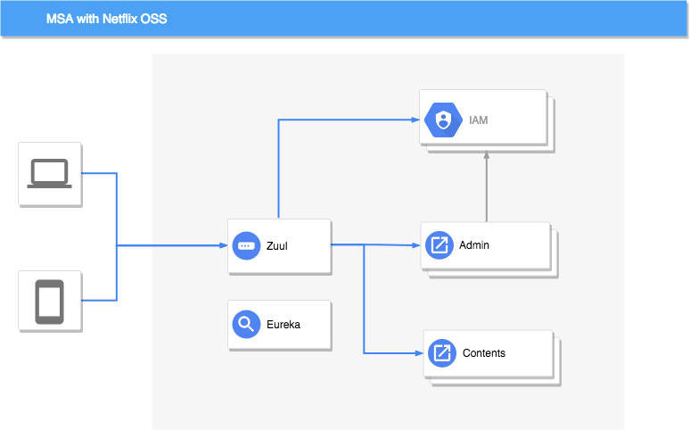
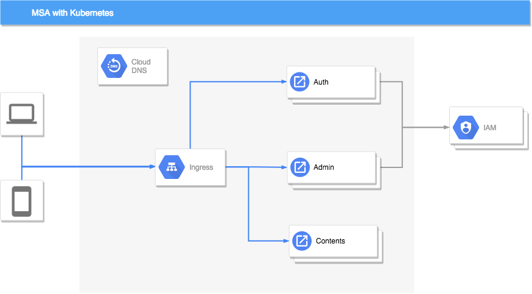

## 1. Before we start

### 1.1 Compare Netflix OSS with Kubernetes

| Microservices    | Spring Cloud & Netflix OSS  |Kubernetes      |
|------|------|------|
| Config Management|[Config Server][Config Server], Consul, Netflix Archaius | Config Map & Secret |
| Service Discovery                  | [Eureka][Eureka] | Kubernetes DNS                     |
| Load Balancing                     | [Netflix Ribbon][Ribbon]                | Kubernetes Service                                  |
| API Gateway                        | [Netflix Zuul][Zuul]                    | Kubernetes Service & [Ingress Resources][Ingress]   |
| Centralized Logging                | [EFK][EFK]                              | EFK                                                 |
| Centralized Metrics                | Netflix Spectator & Atlas, [SpringBootAdmin][SpringBootAdmin]| Heapster, Prometheus, Grafana  |
| Distributed Tracing                | [Spring Cloud Sleuth][Sleuth], Zipkin, [Pinpoint][Pinpoint]   | OpenTracing, Zipkin           |
| Resilience & Fault Tolerance       | [Netflix Hystrix][Hystrix], Turbine & Ribbon | Kubernetes Health Check & Resource Isolation   |
| Auto Scaling & Self Healing        | -                                       | Kubernetes Health Check, Self Healing, Autoscailing |
| Packaging, Deployment & Scheduling | Spring Boot                             | Docker/Rkt, Kubernetes Scheduler & [Deployment][Deployment]|
| Job Management                     | Spring Batch                            | Kubernetes Jobs & Scheduled Jobs                    |
| Singleton Application              | Spring Cloud Cluster                    | Kubernetes Pods                                     |

### 1.2 Microservice Architecture

### 1.3 K8s Architecture

## 2. Let's get started

### 2.1 Client request to gateway : Ingress
  convert Netflix OSS Zuul to K8s-Ingress....
   - [how to setup Ingress][ConvertIngress]
     - install Nginx Ingress
     - configure routing rules
     - [add auth-service](./ingress/auth-service-deploy.md)

### 2.2 Why do we need auth-service?
      

  - Zuul offers filters like the above image, but Ingress does not.  
  Only configuration routing rules are allowed on Ingress. Thus we have to run a seperate auth-service.     

  - [Auth-service](./ingress/auth-service-deploy.md)'s features are equal to Zuul Filters
    - Authentication
    - Authorization

### 2.3 Let's run applications

#### 2.3.0 Remove Netflix OSS settings (only for Netflix OSS applied projects)
 - It is not mandatory to use Netflix OSS stack on K8s environment. But still you can utilize K8s functions instead of ones from Netflix OSS stack, the following guides are recommended.  
 - Key settings
   - remove Netflix OSS configurations (Eureka, Spring Cloud Config..)
   - convert IP based requests to K8s DNS resolver based requests  
   [converting guide](./service_converting/contents/modify_netflix_in_content.md)    

> **How applications connect each other on K8s?**  
 Internal or external calling is available with service object's service name.
 [What's service object?][Service]  

#### 2.3.1 Dockerize an application
- You have to build a docker image to deploy an application on K8s  
[Dockerize](./service_converting/contents/dockerize_content.md)
#### 2.3.2 Run on K8s
- Deploying images on K8s  
[K8s Deploy](./service_converting/contents/run_content_in_k8s.md)
#### Appendix: Deployment with CI/CD
- [K8s Jenkins deploy](../3.CICD/kubernetes_deploy.md)
#### Appendix: Deployment of database on K8s
- [mariadb](./mariadb/README.md)
- [mongo](./mongo/README.md)
- [redis](./redis/README.md)
- [rabbitmq](./rabbitmq/README.md)

  [Config Server]: https://coe.gitbook.io/guide/config/springcloudconfig "Config Server"
  [Eureka]: https://coe.gitbook.io/guide/service-discovery/eureka "Eureka"
  [Ribbon]: https://coe.gitbook.io/guide/load-balancing/ribbon "Ribbon"
  [Zuul]: https://coe.gitbook.io/guide/gateway/zuul "Zuul"
  [EFK]: https://coe.gitbook.io/guide/log/efk "EFK"
  [SpringBootAdmin]: https://coe.gitbook.io/guide/monitoring/spring-boot-admin "SpringBootAdmin"
  [Sleuth]: https://coe.gitbook.io/guide/log/sleuth "Sleuth"
  [Pinpoint]: https://coe.gitbook.io/guide/tracing/pinpoint "Pinpoint"
  [Hystrix]: https://coe.gitbook.io/guide/circuit-breaker/hystrix "Hystrix"
  [Deployment]: ../2.개념/deploymentstrategies.md "Deployment"
  [Service]: ../2.개념/kubernetes.md#27-service "Service"

  [Ingress]: ../2.개념/kubernetes-ingress.md "Ingress"

  [ConvertIngress]: ./ingress/README.md "ConvertIngress"

  [KubernetesService]: https://kubernetes.io/docs/concepts/services-networking/service/ "KubernetesService"
