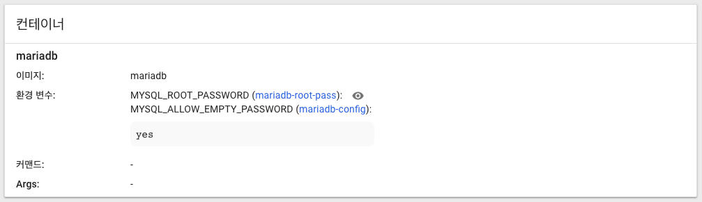

# MariaDB 인스턴스 올리기

MariaDB 단일 인스턴스를 StatefulSet을 이용하여 올리도록 하겠습니다.

쿠버네티스 환경(minikube, kubeadm 등)이 구축 되었다고 가정하고 진행하도록 하겠습니다.

# 1. StatefulSet 만들기

- maria-stateful.yml

본 파일은 StatefulSet을 이용하여 MariaDB Pod을 생성하고 있다.

MariaDB 도커 이미지를 실행할 때 사용할 하나 이상의 환경변수를 containers.env 속성으로 설정할 수 있다.

여러 환경변수값 중 MYSQL_ROOT_PASSWORD 속성값은 반드시 설정해주어야 한다.

이 값은 MariaDB root superuser 계정을 설정할 때 사용된다.

따라서 아래와 같이 StatefulSet 혹은 Pod을 생성할 때 **containers.env.name: MYSQL_ROOT_PASSWORD**을 반드시 선언해야 한다.

```yaml
apiVersion: apps/v1beta1
kind: StatefulSet
metadata:
  name: mariadb
spec:
  serviceName: "mariadb"
  updateStrategy:
    type: RollingUpdate
  replicas: 1
  template:
    metadata:
      labels:
        role: "mariadb"
        environment: development
    spec:
      terminationGracePeriodSeconds: 10
      containers:
      - name: mariadb
        image: mariadb
        ports:
        - containerPort: 3306
        env:
        - name: MYSQL_ROOT_PASSWORD
          value: "your-password"
        - name: MYSQL_ALLOW_EMPTY_PASSWORD
          value: "yes"
        volumeMounts:
        - name: local-claim
          mountPath: /var/lib/mysql
```
~~~


위와 같은 내용으로 파일을 만들고 아래의 명령으로 실행하여 StatefulSet 리소스를 생성합니다.

~~~bash
$ kubectl create -f [파일명].yml
~~~

위 설정의 문제는 볼륨에 대한 마운팅이 없기 때문에 StatefulSet이 완전히 종료 되면 기존에 MariaDB에 저장 되었던 데이터가 사라지는 문제가 있습니다.


# 2. PersistenceVolume 만들기 
데이터를 유지하기 위해서 PersistentVolume 리소스를 아래와 같이 생성합니다.

해당 예제는 볼륨을 local에 지정하였습니다.

만약 aws, glusterfs 등을 이용하여 다이나믹 프로비져닝을 할 경우에는 쿠버네티스 홈페이지를 참조하십시오. 
   
- maria-pv.yml

```yaml
apiVersion: v1
kind: PersistentVolume
metadata:
 name: pv-local-mariadb
spec:
 capacity:
   storage: 10Gi
 accessModes:
 - ReadWriteOnce
 persistentVolumeReclaimPolicy: Retain
 storageClassName: local-mariadb-storage
 local:
   path: /home/actmember/workspace/mariadb/data
 nodeAffinity:
   required:
     nodeSelectorTerms:
     - matchExpressions:
       - key: kubernetes.io/hostname
         operator: In
         values:
         - act-kube-01
   ```
> 위 설정 중 마지막의 minikube는 해당 볼륨이 생성될 노드의 이름입니다.
노드의 이름은 아래의 명령어로 확인 가능합니다.
~~~bash
$ kubectl get nodes
~~~
그리고 path는 마운팅 될 저장소의 경로입니다.

# 3. StatefulSet 수정

위의 StatefulSet 설정을 아래와 같이 수정합니다.

- maria-stateful.yml
```yaml
apiVersion: apps/v1beta1
kind: StatefulSet
metadata:
  name: mariadb
spec:
  serviceName: "mariadb"
  updateStrategy:
    type: RollingUpdate
  replicas: 1
  template:
    metadata:
      labels:
        role: "mariadb"
        environment: development
    spec:
      terminationGracePeriodSeconds: 10
      containers:
      - name: mariadb
        image: mariadb
        ports:
        - containerPort: 3306
        env:
        - name: MYSQL_ROOT_PASSWORD
          value: "your-password"
        - name: MYSQL_ALLOW_EMPTY_PASSWORD
          value: "yes"
        volumeMounts:
        - name: local-claim
          mountPath: /var/lib/mysql
  volumeClaimTemplates:
  - metadata:
      name: local-claim
    spec:
      accessModes:
      - ReadWriteOnce
      storageClassName: local-mariadb-storage
      resources:
        requests:
          storage: 1Gi
```

# 4. 실행

위의 yml파일을 순차적으로 실행합니다.

~~~bash
$ kubectl create -f maria-pv.yml
$ kubectl create -f maria-stateful.yml
~~~

만약 성공적으로 실행이 되었다면 대쉬보드 또는 아래의 명령어를 통해서 팟이 실행된 것을 확인 할 수 있습니다.

~~~bash
$ kubectl get pods
~~~

다음 MariaDB에 접속하여 데이터를 넣도록 합니다.
~~~bash
$ kubectl exec -it mariadb-0 /bin/bash
# mysql -u root -p
Enter password:
# create database mydb;
# show databases;
# use mydb;
# create user 'myuser'@'%'IDENTIFIED BY'mypass';
# grant all privileges on mydb.*TO'myuser'@'%';
# flush privileges;
# create table mytable (id INT PRIMARY KEY, name VARCHAR(20));
# insert into mytable values (1, 'Willium');
# insert into mytable values (2, 'Marry');
# select id, name from mytable;
~~~

볼륨이 마운팅이 정상적으로 되었다면 해당 Pod이 죽고 다시 재 실행이 되어도 해당 데이터가 유지가 되어야 합니다.

kubectl delete 명령어를 통해서 강제로 StatefulSet이나 팟을 죽인 이후에 다시 MariaDB에 접속합니다.

아래와 같은 명령어를 통해서 위에서 입력한 데이터가 살아 있는지 확인합니다.
~~~bash
$ kubectl exec -it mariadb-0 /bin/bash
# mysql -u root -p
Enter password:
# use mydb;
# select id, name from mytable;
~~~

# 5. 환경변수를 ConfigMap으로 저장

다음과 같은 명령으로 필요한 환경변수를 ConfigMap에 저장합니다.
~~~bash
$ kubectl create configmap --from-literal=MYSQL_ROOT_PASSWORD=your-password --from-literal=MYSQL_ALLOW_EMPTY_PASSWORD=yes
$ kubectl get configmap mariadb-config -o yaml
~~~

그 다음 위에서 작성한 maria-stateful.yml에 env.value 대신 env.valueFrom 속성을 사용하여 ConfigMap에서 환경변수 값을 가져오도록 변경합니다.

- maria-stateful-configmap.yml
```yaml
apiVersion: apps/v1beta1
kind: StatefulSet
metadata:
  name: mariadb
spec:
  serviceName: "mariadb"
  updateStrategy:
    type: RollingUpdate
  replicas: 1
  template:
    metadata:
      labels:
        role: "mariadb"
        environment: development
    spec:
      terminationGracePeriodSeconds: 10
      containers:
      - name: mariadb
        image: mariadb
        ports:
        - containerPort: 3306
        env:
        - name: MYSQL_ROOT_PASSWORD
          valueFrom:
            configMapKeyRef:
              name: mariadb-config
              key: MYSQL_ROOT_PASSWORD
        - name: MYSQL_ALLOW_EMPTY_PASSWORD
          valueFrom:
            configMapKeyRef:
              name: mariadb-config
              key: MYSQL_ALLOW_EMPTY_PASSWORD
        volumeMounts:
        - name: local-claim
          mountPath: /var/lib/mysql
  volumeClaimTemplates: ... 

```

maria-stateful.yml을 실행하는 것 대신 maria-stateful-configmap.yml을 실행하여 Pod을 생성합니다.
~~~bash
$ kubectl create -f maria-pv.yml
$ kubectl create -f maria-stateful-configmap.yml
~~~

# 6. Secret을 이용한 환경변수값 암호화하기

비밀번호와 같은 보안이 필요한 환경변수 값을 암호화하기 위해 다음 명령을 통해 Secret 저장소를 생성합니다.

~~~bash
kubectl create secret generic mariadb-root-pass --from-literal=MYSQL_ROOT_PASSWORD=your-password
kubectl get secret mariadb-root-pass -o yaml
~~~

다음 명령을 통해 암호화하기 전 MYSQL_ROOT_PASSWORD를 확인합니다.

~~~bash
echo amVlcDh3YWxydXM= | base64 --decode
~~~

Pod 생성 시 Secret을 사용하기 위해 다음과 같이 configMapKeyRef를 secretKeyRef으로 변경합니다.

```yaml
apiVersion: apps/v1beta1
kind: StatefulSet
metadata:
  name: mariadb
spec:
  serviceName: "mariadb"
  updateStrategy:
    type: RollingUpdate
  replicas: 1
  template:
    metadata:
      labels:
        role: "mariadb"
        environment: development
    spec:
      terminationGracePeriodSeconds: 10
      containers:
      - name: mariadb
        image: mariadb
        ports:
        - containerPort: 3306
        env:
        - name: MYSQL_ROOT_PASSWORD
          valueFrom:
            secretKeyRef:
              name: mariadb-root-pass
              key: MYSQL_ROOT_PASSWORD
        - name: MYSQL_ALLOW_EMPTY_PASSWORD
          valueFrom:
            configMapKeyRef:
              name: mariadb-config
              key: MYSQL_ALLOW_EMPTY_PASSWORD
        volumeMounts:
        - name: local-claim
          mountPath: /var/lib/mysql
  volumeClaimTemplates: ...
```

maria-stateful-configmap.yml을 실행하는 것 대신 maria-stateful-secret.yml을 실행하여 Pod을 생성합니다.

~~~bash
$ kubectl create -f maria-pv.yml
$ kubectl create -f maria-stateful-secret.yml
~~~

