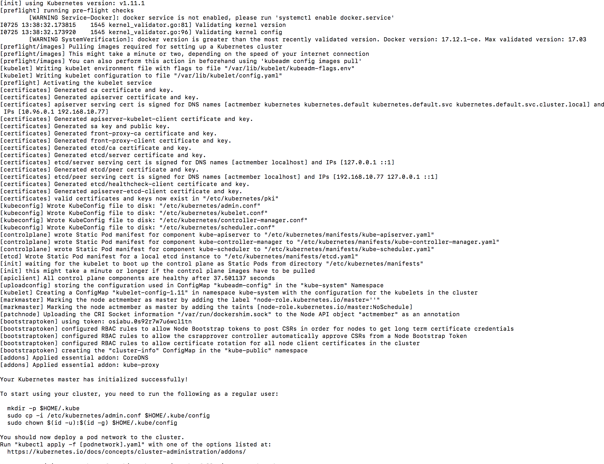
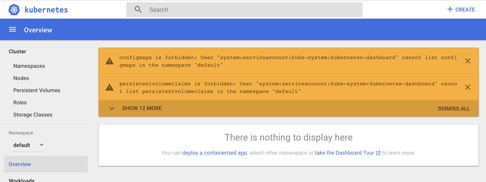
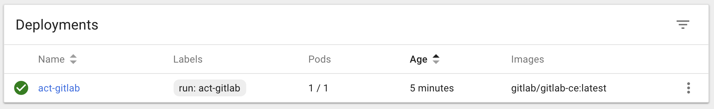
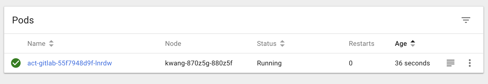
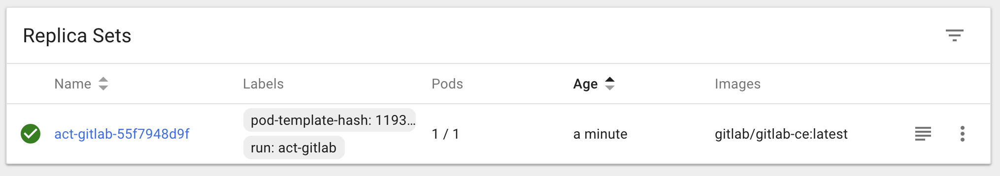
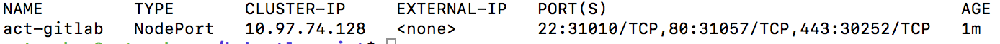
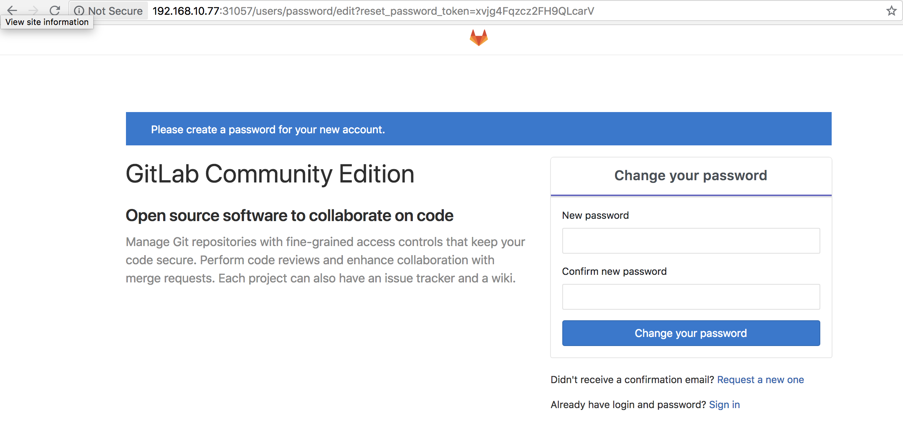

# kubeadm 을 이용한 클러스터 구축

kubeadm은 쿠버네티스 클러스트를 만들기 위한 최선의 빠른 방법으로
kubeadm init 및 kubeadm join을 제공하기 위한 개발 된 도구입니다.

kuberadm 은 실행 가능한 최소한의 클러스터를 가동하고 실행하는데 필요한 조치를 수행합니다.

## 1. 설치
총 3대의 장비를 준비하였으며 각 장비에는 ubuntu 18.04 버전을 설치 하였습니다.

그 중 한대는 마스터 노드 나머지 두대는 워커 노드로 작업을 수행합니다.

### 1.1 도커 설치

쿠버네티스 설치 레퍼런스에 의하면 17.03이 권장 되지만 1.11, 1.12 및 1.13도 잘 작동이 된다고 합니다.

다만 17.06 이상은 작동하지만 아직 완벽한 검증이 되지는 않았다고 합니다.

~~~bash
$ apt-get update
$ apt-get install -y docker.io
~~~

### 1.2 kubeadm, kubelet, kubectl 설치

* kubeadm - 클러스터를 부트스트랩 하는 command

* kubelet - 클러스터의 모든 기기에서 실행되는 구성요소로, 팟 및 컨테이너 시작과 같은 작업을 수행

* kubectl - 클러스터와 대화를 하기 위한 command 유틸

구글로부터 인증서를 받고 레파지토리를 추가한 이후 해당 모듈들을 설치를 하게 됩니다.

~~~bash
$ apt-get update && apt-get install -y apt-transport-https curl
$ curl -s https://packages.cloud.google.com/apt/doc/apt-key.gpg | apt-key add -
$ cat <<EOF >/etc/apt/sources.list.d/kubernetes.list
deb http://apt.kubernetes.io/ kubernetes-xenial main
EOF
$ apt-get update
$ apt-get install -y kubelet kubeadm kubectl
~~~

### 1.3 cgroup driver 설정(마스터 노드)
도커와 kubeadm은 자동적으로 cgroup driver 를 찾아서 설정합니다.

다만 다른 cgroup-driver를 사용하길 원하면 변경이 필요합니다.

일반적으로 docker에서 사용하는 cgroup과  kubeadm이 사용하는 cgroup을 일치 시켜 주도록 합니다.

아래의 명령어를 실행시켜 나오는 cgroup드라이버 명을
~~~bash
$ docker info | grep cgroup
~~~

/etc/default/kubelet 파일에 아래와 같이 추가합니다.
~~~
KUBELET_KUBEADM_EXTRA_ARGS=--cgroup-driver=<value>
~~~

## 2. kubeadm init 및 join

### 2.1 kubeadm init
먼저 마스터 노드에서 kubeadm init 명령어를 실행합니다

해당 명령어는 쿠버네티스 마스터 노드를 초기화 합니다.

흐름은 다음와 같습니다.

* 변경하기 전 일련의 사전 점검을 실행하여 시스템을 확인합니다. 일부 검사는 경고만 트리거하고 다른 경우 오류로 간주하여 문제가 해결되거나 사용자가 --skip-preflights-check를 지정할 때 까지 kubeadm을 종료합니다.

* 클러스터의 각 구성 요소에 대한 ID를 설정하기 위해 자체 서명된 CA를 생성합니다. 사용자가 자신의 CA 인증서 및 키를 --cert-dir을 통해 구성 된 경우 스킵 합니다. APIServer 인증서는 필요한 경우 --apiserver-cert-extra-sans SAN항목을 소문자로 표시합니다.

* administration을 위한 admin.conf 파일을 추가 할 뿐 아니라 kubelet, 컨트롤러 관리자 및 scheduler가 API 서버에 연결하기 위해 /etc/kubernetes/ 에 kubeconfig 파일을 작성합니다.

* API 서버, 컨트롤러 관리자 및 스케줄러에 대한 정적 팟 매니페스트를 생성합니다. 외부 etcd가 제공되지 않는 경우 etcd에 대한 추가 정적 팟 매니페스트가 생성됩니다.

다음 명령어를 실행하며 마스터 노드를 초기화 합니다.

~~~bash
$ sudo kubeadm init --apiserver-advertise-address [ip주소]
~~~

여기서 --apiserver-advertise-address 옵션은 마스터 노드와 워커 노드가 공개 IP주소 대신 내부 IP 주소와 통신하는 클러스터를 만들기 위한 옵션으로 뒤에 마스터 노드의 내부 IP주소를 설정하면 됩니다.

실행이 되면 아래와 같은 화면을 볼 수 있습니다.

위에서 설명 한 것처럼 사전체크와 CA체크 각종 설정 파일 생성과 팟을 생성하는 모습을 볼 수 있습니다.

그리고 정상적으로 실행이 되면 로그에 클러스터를 사용하려면 일반 사용자로 다음 명령을 실행하라는 문구가 보입니다.

~~~bash
$ mkdir -p $HOME/.kube
$ sudo cp -i /etc/kubernetes/admin.conf $HOME/.kube/config
$ sudo chown $(id -u):$(id -g) $HOME/.kube/config
~~~

그리고 팟 네트워크를 배포해야 하고 그러기 위해서는 https://kubernetes.io/docs/concepts/cluster-administration/addons/ 에서 하나의 옵션을 선택해서 실행해야 합니다.

해당 사이트에서 Weave Net을 선택해서 설치합니다.

~~~bash
$ kubectl apply -f "https://cloud.weave.works/k8s/net?k8s-version=$(kubectl version | base64 | tr -d '\n')"
~~~

마지막으로 다음 명령을 실행하여 정상적으로 노드와 팟들이 생성되었는지 확인합니다.

~~~bash
$ kubectl get nodes
$ kubectl get pods --all-namespaces
~~~

## 2.2 kubeadm join
위에서 마스터노드를 초기화 할 때 마지막에 나온 join 구문을 복사해두었다가 워커노드에서 그대로 실행시켜 줍니다.

만약 해당 토큰이 기억이 나지 않는다면 마스터 노드에서 아래의 명령어로 조회를 하면 됩니다.
~~~bash
$ sudo kubeadm token list
~~~

노드 추가가 정상적으로 되었다면 마스터 노드에서 정상적으로 클러스터링이 되었는지 확인합니다.
~~~bash
$ sudo kubeadm get nodes
~~~

## 3. dashboard 설치
쿠버네티스 대쉬보드는 쿠버네티스 클러스트를 위한 웹 기반 UI입니다. 이를 통해 사용자는 클러스터에서 실행 중인 응용 프로그램을 관리하고 문제를 해결하고 클러스터를 관리 할 수 있습니다.

쿠버네티스 대쉬보드는 두 가지 설치 방법이 존재합니다.

* Recommended Setup
  * 일반적으로 대쉬보드에 직접 접근하려면(kubectl proxy 없이) 유효한 인증서를 사용하여 HTTPS 연결을 설정해야 합니다.

  * 이 설정을 사용하려면 인증서가 kube-system 네임스페이스의 kubernetes-dashboard-certs라는 secret 에 저장되어 있어야 합니다.

  * $HOME/cert 폴더 및에 dashboard.crt 및 dashboard/key 파일이 저장되어 있다고 가정하면 다음 파일의 내용으로 secret을 만들어야 합니다.
  ~~~bash
  $ kubectl create secret generic kubernetes-dashboard-certs --from-file=$HOME/certs -n kube-system
  ~~~

  * 다음으로 dashboard를 deploy 합니다.
  ~~~bash
  $ kubectl apply -f https://raw.githubusercontent.com/kubernetes/dashboard/master/src/deploy/recommended/kubernetes-dashboard.yaml
  ~~~

* Alternative Setup (여기서는 이 방법 사용)
  * 이 방법은 안전하지 않습니다. 인증서는 사용되지 않으며 대쉬보드는 HTTP를 통해서만 노출이 됩니다. 이 설정에서는 Authorization Header 기능을 사용하는 경우에만 접근이 가능합니다.

  ~~~bash
  $ kubectl apply -f https://raw.githubusercontent.com/kubernetes/dashboard/master/src/deploy/alternative/kubernetes-dashboard.yaml
  ~~~

대쉬보드를 클러스터 외부에서 접근 하려면 쿠버네티스 대쉬보드의 포트를 노출 시켜줘야 합니다.

아래의 명령어를 실행시키면 kube-system 네임스페이스로 실행중인 서비스를 확인 할 수 있습니다.

~~~bash
$ kubectl get svc -n kube-system
~~~

여기서 kubernetes-dashboard의 type을 변경하겠습니다.
~~~bash
$ kubectl edit svc -n kube-system kubernetes-dashboard
~~~

위 명령어를 실행하면 type: ClusterIP라는 항목이 보입니다.

이 항목을 NodePort 로 변경합니다.

그리고 다시 아래 명령어를 실행하면
~~~bash
$ kubectl get svc -n kube-system
~~~

kubernetes-dashboard 의 port가 변경 된 것을 확인 할 수 있습니다.

웹 브라우저를 열고 http://[apiserver-ip]:[port] 를 입력합니다. 여기서 포트는 위에서 확인 한 포트입니다.

아래와 같은 화면을 볼 수 있는데 1.7버전 부터 더 이상 기본적으로 전체 관리 권한이 부여되지 않기 때문입니다.

이 문제를 해결하려면 아래와 같은 방법이 존재합니다.
* Authorization Header
  * 인증 헤더를 사용하려면 모든 요청에 'Authorization: Bearer <token>' 을 전달합니다.

  * 즉 결과적으로 대쉬보드 앞에 역방향 프록시를 구축하여 이를 수행해야 합니다.

* Admin privileges
  * 관리자 권한을 부여하는 것은 보안상 위험하지만 여기서는 예제이기 때문에 이 방법을 사용합니다.

  * ClusterRoleBinding 아래에 생성하여 대쉬보드의 서비스 계정에 전체 관리자 권한을 부여 할 수 있습니다. 다음 내용을 yam 파일로 만들고 실행합니다.

  ~~~yml
  apiVersion: rbac.authorization.k8s.io/v1beta1
  kind: ClusterRoleBinding
  metadata:
    name: kubernetes-dashboard
    labels:
      k8s-app: kubernetes-dashboard
  roleRef:
    apiGroup: rbac.authorization.k8s.io
    kind: ClusterRole
    name: cluster-admin
  subjects:
  - kind: ServiceAccount
    name: kubernetes-dashboard
    namespace: kube-system
  ~~~

  ~~~bash
  $ kubectl create -f [파일명].yaml
  ~~~

## 4. deployement 생성하기
pod을 생성한 이후 expose 명령어를 통해서 서비스로 노출 시킬 수 있지만 복제 등의 기능을 하기 위해서 처음부터 deployment로 만들겠습니다.

생성할 이미지는 gitlab/gitlab-ce/latest 입니다.

~~~bash
$ kubectl run act-gitlab --image=gitlab/gitlab-ce:latest
~~~

명령어를 실행한 이후 대쉬보드에서 deployment, pod, replicaset이 생성 되었음을 확인 할 수 있습니다.

하지만 외부로 노출 시키기 위해서는 서비스로 등록을 해야 합니다.

~~~bash
$ kubectl expose deployment act-gitlab --port=22,80,443 --type=NodePort
~~~

위 명령어를 실행 한 이후 아래 명령어를 통해서 노출 된 포트를 확인합니다.

~~~bash
$ kubectl get svc/act-gitlab
~~~

웹 브라우저에서 http://[클러스터ip]:[노출된 포트] 를 입력합니다.

