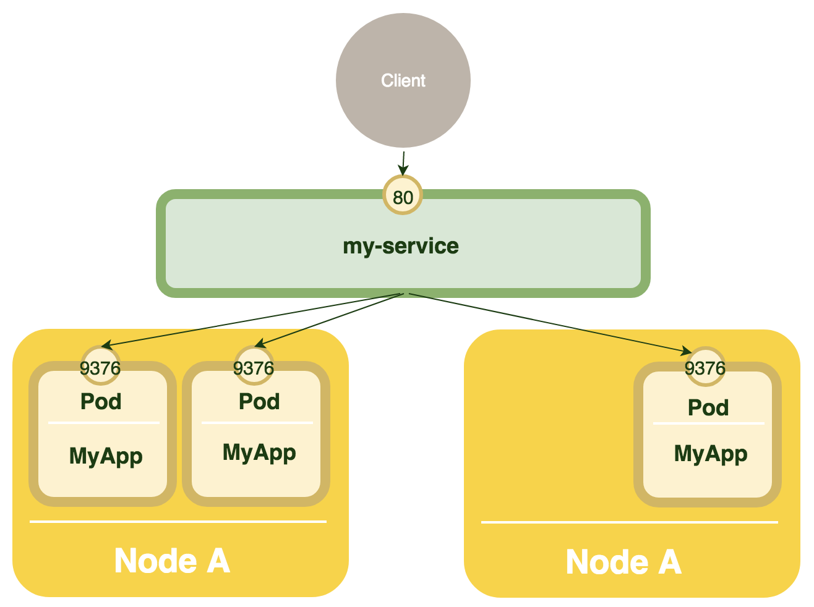

# 쿠버네티스 개념 및 용어 설명

## 1. 쿠버네티스와 컨테이너
쿠버네티스는 어플리케이션을 배포하고 확장 및 관리를 자동화하는 대규모 오픈소스 프로젝트입니다.

전통적으로 모든 것을 포함하고 있는 PaaS는 아니며 하드웨어 수준이 아닌 컨테이너 수준에서 작동하고 배포, 확장, Load Balancing, 로깅, 모니터링과 같은 PaaS에서 공통적으로 적용되는 몇 가지 기능을 제공합니다.

### 1.1 컨테이너를 사용하는 이유
* 기존에 응용프로그램을 배포하는 방식은 실행 파일, 설정, 라이브러리 및 라이프사이클을 다른 어플리케이션 뿐만 아니라 호스트OS와 얽히게 하는 단점이 있습니다. 이러한 방식은 롤아웃 및 롤백을 수행하기 위해 가상 시스템 이미지를 작성 할 수 있지만 이러한 VM은 무겁고 휴대성이 떨어집니다.

* 하드웨어 가상화가 아닌 운영 체제 수준의 가상화를 기반으로 컨테이너를 배포하게 되면 다른 컨테이너 뿐만 아니라 호스트로부터 **격리** 가 됩니다. 이러한 컨테이너는 자신만의 파일 시스템을 가지고 서로의 프로세스로부터 독립적이게 됩니다. 전반적으로 VM보다 빌드가 쉽고 인프라와 호스트 파일 시스템에서 분리 되기 때문에 클라우드 및 여러 환경에서 휴대성이 좋습니다.

* 하나의 어플리케이션이 하나의 컨테이너 이미지(one to one application - image) 관계는 독립적이게 되며 운영 및 인프라 환경과 결합 할 필요가 없이 빌드/릴리즈 시간에 변경할 수 없는 이미지를 만들 수 있습니다.

* 이렇게 작성된 이미지는 개발 환경에서 운영 환경과 동일한 환경 구성을 가능하게 합니다.

* 즉 아래와 같이 요약 할 수 있습니다.
  * 민첩한(Agile) 어플리케이션 제작 및 배포 : VM 대비 경량 및 휴대성이 좋음

  * 지속적인 개발과 CI/CD : 빠르고 일관성 있는 컨테이너 이미지 작성/배포 뿐 아니라 빠른 롤백이 가능

  * Dev와 Ops 분리 문제 : 배포 시간이 아닌 빌드/릴리즈 시간에 컨테이너 이미지를 만들기 때문에 인프라 구조로부터 분리가 가능(배포환경에 대한 고려 불필요)

  * 클라우드 환경 뿐 아니라 여러 OS 배포 환경에 대한 이식성이 높음

  * 하나의 대형 단일 머신에서 실행되는 단일 스택이 아니라 거대한 어플리케이션을 작고 독립적인 조각으로 나눌 수 있기 때문에 마이크로서비스에 적합

### 1.2 오케스트레이션
쿠버네티스의 가장 중요한 임무는 컨테이너 서비스 오케스트레이션입니다.  
쿠버네티스는 다양한 작업(workload)을 수행하는 모든 컨테이너가 물리적인 머신이나 가상 머신에서 실행 되는지 확인합니다.  
쿠버네티스는 실행 중인 모든 컨테이너를 감시하고 상태가 이상한 컨테이너를 교체하는 역할을 합니다.  

- Service Discovery
- Load Balancing
- Zero-downtime deploys
- Secrets/configuration/storage management
- Health checks
- Auto scaling/restart/healing of containers and nodes  

## 2. 용어

### 2.1 Cluster
클러스터는 노드와 마스터를 통칭하는 개념으로 클러스터 내에는 최소한 3개 의 노드가 있는 것이 좋습니다.  
다수의 호스트 저장소와 네트워킹 자원의 집합이며 이 곳에서 쿠버네티스 시스템을 구성합니다.  
  

### 2.2 Master
마스터는 쿠버네티스의 제어 플레인(control plane)의 중심으로서 클러스터를 관리합니다.    
마스터에는 아래와 같은 여러 컴포넌트로 이루어 집니다.  

* kube-apiserver  
  * 쿠버네티스는 다양한 목적과 대상을 위해 REST API를 제공합니다. 사용자들은 정해진 api로 원하는 설정을 post하게 됩니다.  
  * 오브젝트 목록 조회, 생성, 변경 등을 지시 할 수 있습니다. 아래의 명령어를 실행 할 경우 모든 팟의 목록을 가져옵니다.  
  ~~~
    GET /api/v1/pods
  ~~~

* kube-scheduler
  * 팟(pod)을 감시하고 어떤 노드에서 실행될지를 선택합니다.  

* kube-controller-manager : 컨트롤러를 실행하는 마스터의 구성요소이며,  
논리적으로 각 컨트롤러는 별도의 프로세스이지만 복잡성을 줄이기 위해 하나의 binary로 컴파일 되어 하나의 프로세스로 실행 됩니다.  
구성 요소는 아래와 같습니다.  
  * Node Controller : 노드 다운시 알림과 반응  
  * Replication Controller : Pod의 설정 값 (갯수 등)을 유지하는 기능  
  * Endpoints Controller : Service와 Pods의 endpoint를 관리.  
  * Service Account & Token Controller : 계정과 namespace를 위한 API 접속 토큰 생성  

* etcd  
  * 쿠버네티스 클러스터의 모든 데이터를 보관하기 위한 분산형 key-value 저장소     

* cloud-controller-manager
클라우드 서비스와 상호작용. Alpha version in Kubernetes 1.6  
  * Node Controller: 클라우드 상에서의 node 상태 체크  
  * Route Controller: 클라우드 상에서의 라우팅  
  * Service Controller: cloud provider load balancers를 관리  
  * Volume Controller: 클라우드 상에서의 volumne를 관리  

### 2.3 Node
노드는 단일 호스트이며 물리적 머신이나 가상 머신이 될 수 있습니다.  
노드 위에서 팟(pod) 뿐만 아니라 쿠버네티스 컴포넌트가 실행 됩니다.  
    

* kubelet : 클러스터의 각 노드에서 실행되는 에이전트로서 pod 안의 컨테이너가 잘 실행되는지 관리한다.  
마스터의 API 서버와 통신을 하면서 노드에게 들어온 명령을 수행하고 노드의 상태들을 마스터로 전달하는 역할을 한다.  

* kube-proxy : 네트워크 룰을 관리하며 서비스간의 연결을 관리한다.  

* Container Runtime : 실행중인 container를 관리한다.  

### 2.4 Pod
팟은 쿠버네티스의 작업 단위입니다. 팟에는 한 개 이상의 컨테이너를 포함하고 있습니다.  
동일한 머신에서 실행 되는 여러 팟은 항상 함께 스케쥴링 됩니다.  
팟 내부의 컨테이너는 IP주소와 포트공간이 동일하며(localhost로 통신가능) 표준 IPC로 서로 통신합니다.  
팟 내부의 컨테이너들은 해당 팟이 호스팅하는 노드에 있는 공유 저장소에 접근이 가능합니다.  
쿠버네티스 없이 기존 도커도 하나의 컨테이너 내에 여러 어플리케이션을 실행 할 수 있지만 쿠버네티스 팟의 경우 투명성, 소프트웨어 의존성 분리, 효율성(인프라에 더 많은 역할이 부여되어 컨테이너를 경량화)과 같은 장점이 존재합니다.  

### 2.5 Label
라벨은 key-value 쌍의 오브젝트 집합이며 주로 팟을 그룹화 할 때 사용합니다.  
라벨의 경우 Name이나 UID와 다르기 때문에 오브젝트간 동일한 라벨을 가질 수 있습니다.  
다른 오브젝트에서는 라벨 셀렉터를 통해서 특정 오브젝트를 선택 할 수 있습니다.  

### 2.6 Annotation
쿠버네티스 오브젝트의 사용자 정의 metadata 입니다.  
라벨과 다르게 어노테이션은 오브젝트를 식별하고 선택하는데 사용되지는 않습니다.  
라벨은 정해진 네이밍 규칙이 있지만 어노테이션은 엄격한 제한이 없습니다.  
별도의 메타 데이터 저장소를 마련할 필요가 없기 때문에 타임스탬프, 릴리즈 ID, git branch에 대한 빌드/릴리즈 정보와 책임자 전화번호와 같은 기타 정보를 첨부하는데 사용 할 수 있습니다.  

### 2.7 Service
서비스는 사용자나 다른 서비스에 어떤 기능을 제공합니다.  

서비스는 일반적으로 라벨로 식별 된 팟 그룹을 포함합니다.  

Pods 은 Container를 포함하며 자신의 IP를 갖고 여러 pod들과 통신하며 서비스를 제공할 수 있습니다.  

예를 들어,
```yaml
kind: Service
apiVersion: v1
metadata:
  name: my-service
spec:
  selector:
    app: MyApp
  ports:
  - protocol: TCP
    port: 80
    targetPort: 9376
```
my-service 라는 이름의 서비스는 app=MyApp 이라는 label을 갖는 모든 pod에 대하여 9376 포트로 접근이 가능 합니다.  
이 경우 내부 pod의 일부가 중단되거나 재시작 된경우 ip가 변경되더라도  
해당 pod를 서비스가 찾고 서비스 하는데 전혀 문제가 없습니다.  
    

서비스를 통해 다른 cluster의 서비스에 접근하거나, Kubernetes 외부의 서비스를 호출하도록 할수 있습니다.  

#### Proxy-mode
서비스들은 kube-proxy를 통해 가상 IP를 부여 받고 자신에게 들어온 요청을 backend pods으로 전달 합니다.  
- userspace mode
Serivce의 port로 전송 된 요청을 kube-proxy를 통해 backend pods로 전송, pods의 상태에 따른 유연한 대응 가능  
- iptables
서비스는 자신의 targetPort 정보를 iptable에 등록 하여 직접 backend pods로 요청을 전송, userspace와 kernel space를 거치지 않아 처리가 빠름  

#### Multi-Port Services
#### Discovering Services

- Environment variables
Serive 주소 정보를 설정으로 지정 가능
```
REDIS_MASTER_SERVICE_HOST=10.0.0.11
REDIS_MASTER_SERVICE_PORT=6379
REDIS_MASTER_PORT=tcp://10.0.0.11:6379
REDIS_MASTER_PORT_6379_TCP=tcp://10.0.0.11:6379
REDIS_MASTER_PORT_6379_TCP_PROTO=tcp
REDIS_MASTER_PORT_6379_TCP_PORT=6379
REDIS_MASTER_PORT_6379_TCP_ADDR=10.0.0.11
```
- DNS
Service명으로 DNS 에 등록되어 접근이 가능하게 된다.  
my-serivce라는 이름의 서비스가 my-ns 네임스페이스에 있다면, my-service.my-ns로 등록 됩니다.  
동일한 네임스페이스의 pods은 my-service로 다른 네임스페이스의 경우 my-service.my-ns를 이용하여 해당 서비스의 ip를 얻게 됩니다.  

#### Service publishing types
- Cluster IP  
서비스에게 cluster-internal IP를 부여하여 해당 서비스는 동일 cluster에서만 접근이 가능 함  

- NodePort  
NodePort를 생성하고 이를 cluster 외부에서 접근 할수 있게 함  
<NodeIP>:<NodePort> 로 접속 가능   
NodePort는 30000 ~ 32767 중 하나가 자동 선택 되거나, 임의 지정도 가능   

- LoadBalancer  
Cloud vendor에서 external load balancer를 제공하는 경우, 이 load balancer를 서비스에 바로 라우팅 가능  

- ExternalName  
service를 DNS Name에 매핑 한다.  
```yaml
kind: Service
apiVersion: v1
metadata:
  name: my-service
  namespace: prod
spec:
  type: ExternalName
  externalName: my.database.example.com
```

### 2.8 볼륨
팟의 로컬 저장소는 팟의 소멸과 함께 제거되는 일시적 생명주기를 가집니다.  
(도커 역시 볼륨 마운팅을 하지 않으면 컨테이너 종료시 모든 데이터가 없어집니다.)

데이터가 팟이 종료 된 이후에도 보존되어야 하거나 팟 사이에서 데이터를 주고 받을 필요가 있을 때 사용 됩니다.

### 2.9 StatefulSet

### 2.9 Secret

### 2.9 Name(이름)
쿠버네티스의 오브젝트는 UID와 이름으로 식별 됩니다. 이름은 API 호출 시 오브젝트를 참조 할 때 사용합니다.

UID의 경우 쿠버네티스가 자동을 생성 합니다.

### 2.10 네임스페이스
네임스페이스는 가상 클러스터입니다. 사용자는 네임스페이스는 다른 네임스페이스와 완전히 분리되어 있으며 공용 인터페이스를 통해서만 통신이 가능합니다.

### 2.11 Addons
쿠버네티스의 기능을 확장 하며 아래와 같은 구성요소가 있습니다.  

* DNS : 쿠버네티스 클러스터에는 클러스터 DNS addon은 꼭 필요합니다.  
Pod과 서비스 등은 실행 시에 동적으로 IP가 할당 되는데 실행 될 때마다 IP 주소가 변경 됩니다.  
따라서 쿠버네티스는 리소스의 endpoints를 DNS로 맵핑하고 관리합니다. (일반적으로 마스터 컴포넌트의 일부로 구분됩니다.)  

* Web UI (Dashboard) : 쿠버네티스 클러스터를 위한 일반적인 웹 기반 UI이며 클러스터 자체 뿐만 아니라 클러스터 내에서 실행 중인 어플리케이션도 사용자가 관리하고 문제를 해결 할 수 있습니다.  

* Container Resource Monitoring : 컨테이너에 대한 일반적인 time-series metircs를 중앙 database에 기록하고 해당 데이터를 탐색하기 위한 UI를 제공합니다.

* Cluster-level Logging : 클러스터 레벨의 로깅 메커니즘은 검색/등록 인터페이스를 사용하여 컨테이너 로그를 중앙 로그 저장소에 저장합니다.
