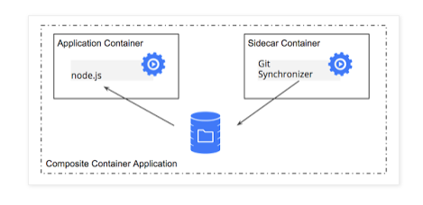
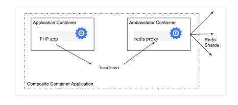
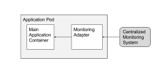

# 쿠버네티스 컨테이너 디자인 패턴

쿠버네티스 Pod은 메인 어플리케이션 컨테이너에 추가적으로 아래의 컨테이너들과 함께 배포됩니다.
- Sidecar Container : 메인 컨테이너의 기능(로깅, 깃 동기화 등)을 추가
- Ambassador Container : 외부 서버에 접속
- Adapter Container : 컨테이너 내부에서 실행되고 있는 어플리케이션에 접근  

### Sidecar Pattern
사이드카 패턴은 메인 컨테이너를 확장하고 기능을 향상시키기 위한 추가적인 컨테이너를 사용하는 것이고, 이 추가적인 컨테이너를 sidecar라고 합니다.

사이드카패턴의 예제로는,

웹서버 컨테이너는 이 웹 서버의 로그들을 읽는 또 다른 사이드카 컨네이너와 함께 배포될 수 있습니다.
즉, 사이드카 컨테이너가 웹서버 컨테이너의 모든 로그를 처리하는 역할을 합니다.
그렇다면 왜 웹서버가 자신의 로그를 자체적으로 처리하지 않을까요?
- Separation of concerns : 웹 서버 컨테이너는 웹 페이지 제공이라는 자신의 관심사에만 집중하게 됩니다. 만약 이슈가 발생하면 다른 관심사와는 분리되어 있기 때문에 문제 상황을 빠르게 식별 가능합니다.
- Single responsibility principle
- Cohesiveness/Reusability : 로그만을 처리하는 사이드카 컨테이너는 다른 어플리케이션에서도 재사용할 수 있습니다.

또 다른 예제로는 Git 레파지토리에 있는 파일과 싱크를 맞춰주는 사이드카 컨테이너를 메인 컨테이너와 함께 배포하는 것입니다.
Git 동기화 컨테이너는 자신의 역할만 하기 때문에 재사용할 수 있고, 어플리케이션 컨테이너는 단순히 DB 서버에 접속만 하면 됩니다.

### Ambassador/Proxy Pattern
이 패턴은 서버들의 그룹에 프록시 역할을 하는 컨테이너(ambassador container)를 사용하는 것입니다.  
주된 목적은 앰버서더 컨테이너를 사용하여 외부서버의 접근을 단순화시키는 것입니다.  
서버 그룹을 호출하기 위해선 이 단일 앰버서더 컨테이너를 통해서 접근하게 됩니다.

### Adapter Pattern
이 패턴은 컨테이너 내부에서 실행되고 있는 어플리케이션에 동일한 방법으로 접근하고 단순화하기 위해서 추가적인 Adapter 컨테이너를 함께 배포합니다. 메인 컨테이너는 어댑터 컨테이너를 통해서 로컬호스트로 통신할 수 있습니다.  
외부 서버로의 접근을 단순화하는 앰버서더 컨테이너와는 다릅니다.  
어댑터 패턴의 예로는 모든 컨테이너들이 동일한 모니터링 인터페이스를 사용하도록 하는 것입니다.

참고 https://vitalflux.com/container-design-patterns-kubernetes-pods-design/

# 쿠버네티스 컴포넌트

### 마스터 컴포넌트
마스터는 쿠버네티스의 제어 플레인(control plane)으로 클러스터를 관리합니다.

마스터에는 아래와 같은 여러 컴포넌트로 이루어 집니다.

* kube-apiserver
  * 쿠버네티스는 다양한 목적과 대상을 위해 REST API를 제공합니다. 일부 API는 주로 도구가 사용하고 일부는 개발자들이 사용합니다.

  * 오브젝트 목록 조회, 생성, 변경 등을 지시 할 수 있습니다. 아래의 명령어를 실행 할 경우 모든 팟의 목록을 가져옵니다.
  ~~~
    GET /api/v1/pods
  ~~~

* etcd
  * 중요한 데이터에 대한 액세스를 안정적이고 신속하게 보존하고 제공하도록 설계 된 분산 key-value 저장소이며 쿠버네티스의 모든 클러스터 상태를 저장합니다. 대규모 클러스터의 경우 일반적으로 이중화를 하게 됩니다.

* kube-scheduler
  * 팟(pod)을 감시하고 어떤 노드에서 실행될지를 선택합니다.

* kube-controller-manager : 컨트롤러를 실행하는 마스터의 구성요소이며 논리적으로 각 컨트롤러는 별도의 프로세스이지만 복잡성을 줄이기 위해 모두 단일 binary로 컴파일 되고 단일 프로세스로 실행 됩니다. 구성 요소는 아래와 같습니다.

  * Node Controller : 노드 다운시 알림과 반응

  * Replication Controller : Pod의 설정 값 (갯수 등)을 유지하는 기능

  * Endpoints Controller : Endpoints Object(서비스/Pod)를 연결한다.

  * Service Account & Token Controller : 계정과 namespace를 위한 API 접속 토큰 생성

### 노드 컴포넌트

* proxy
  * 쿠버네티스 API에 정의된 서비스들을 각 노드에 적용하고 TCP 및 UDP 포워딩을 수행합니다.  

* kublet
  * 마스터 컴포넌트와 통신을 수행하며 실행중인 포드를 관리하고 감독합니다.

### Addons
쿠버네티스의 기능을 확장 하며 아래와 같은 구성요소가 있습니다.

* DNS : addon 들이 꼭 필요한 것은 아니지만 쿠버네티스 클러스터에는 클러스터 DNS가 필요합니다. Pod과 서비스 등은 실행 시에 동적으로 IP가 할당 되는데 실행 될 때마다 IP 주소가 변경 됩니다. 따라서 쿠버네티스는 리소스의 endpoints를 DNS로 맵핑하고 관리합니다. (일반적으로 마스터 컴포넌트의 일부로 구분됩니다.)

* Web UI (Dashboard) : 쿠버네티스 클러스터를 위한 일반적인 웹 기반 UI이며 클러스터 자체 뿐만 아니라 클러스터 내에서 실행 중인 어플리케이션도 사용자가 관리하고 문제를 해결 할 수 있습니다.

* Container Resource Monitoring : 컨테이너에 대한 일반적인 time-series metircs를 중앙 database에 기록하고 해당 데이터를 탐색하기 위한 UI를 제공합니다.

* Cluster-level Logging : 클러스터 레벨의 로깅 메커니즘은 검색/등록 인터페이스를 사용하여 컨테이너 로그를 중앙 로그 저장소에 저장합니다.

# 쿠버네티스 API
모든 동작과 컴포넌트간 통신, 외부 명령은 모두 API 서버가 제공하는 REST API 요청들이다.  
즉, 쿠버네티스 플랫폼에서 동작하는 모든 것들은 API 오브젝트를 통해 관리된다.

REST API를 직접 호출하거나 대부분의 명령은 kubectl 커맨드라인 인터페이스나 kubeadm 같은 툴을 통해서 실행할 수 있다.
