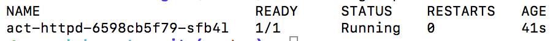
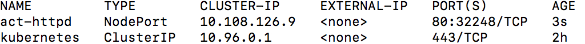
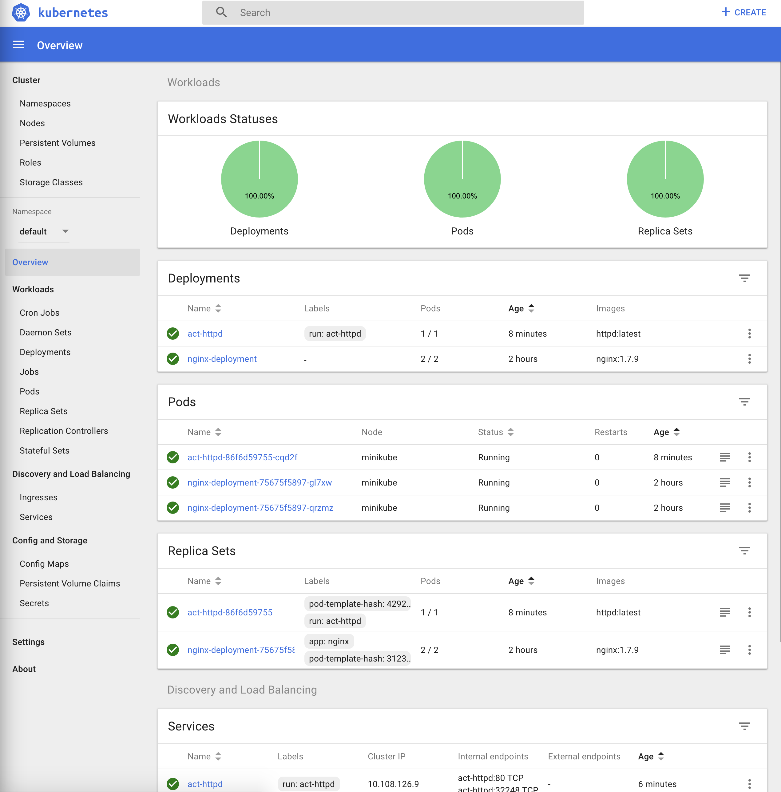

# [Minikube](https://kubernetes.io/docs/tutorials/hello-minikube/)
미니큐브는 로컬 컴퓨터에 가상 머신을 생성하고 하나의 노드만 포함하는 간단한 클러스터를 배포하는 작은 쿠버네티스입니다.

## 1. 설치
  * 필요한 Hypervisor(VirtualBox, VMware fusion, Hyperkit 등)를 설치합니다.

  * kubectl을 설치합니다.
  ~~~bash
  $ brew install kubectl
  ~~~

  * kubectl이 정상적으로 설치 되었는지 버전을 확인합니다.
  ~~~bash
  $ kubectl version
  ~~~

  * minikube를 설치합니다.(작성일 기준 0.28.0 버전 - [Release Version check](https://github.com/kubernetes/minikube/releases))
  ~~~bash
  $ curl -Lo minikube https://storage.googleapis.com/minikube/releases/v0.28.0/minikube-darwin-amd64 && chmod +x minikube && sudo mv minikube /usr/local/bin/
  ~~~
  혹은 Homebrew를 통해서 설치한다 
  ~~~bash
  brew cask install minikube
  ~~~

  * minikube가 정상적으로 설치 되었는지 버전을 확인합니다.
  ~~~bash
  $ minikube version
  ~~~

  * 클러스터를 생성합니다. 
  ~~~bash
  $ minikube start
  ~~~
  혹은 vm-driver option을 시정하여 설정합니다. [오류 발생시 참고](https://github.com/kubernetes/minikube/blob/master/docs/drivers.md#hyperkit-driver)
  ~~~bash
  $ minikube start --vm-driver=hyperkit
  ~~~
  
  성공적으로 실행 되면 아래와 같은 화면을 볼 수 있습니다.
  

  * 클러스터 상태를 확인합니다.
  ~~~bash
  $ kubectl cluster-info
  ~~~

  * 마스터가 정상적으로 동작되었다면 클러스터의 노드를 확인합니다.
  ~~~bash
  $ kubectl get nodes
  ~~~

  미니큐브가 정상적으로 실행 되고 있는 것을 확인 할 수 있습니다.

## 2. 배포하기
kubectl run 명령어로 클러스터에 컨테이너 인스턴스를 실행합니다.

kubectl run 은 복제 가능한 이미지를 실행하고 이렇게 실행된 컨테이너를 관리하는 deployment를 만들게 됩니다.

~~~bash
$ kubectl run act-httpd --image=httpd:latest --port=80
deployment.apps "act-httpd" created
~~~

kubectl 명령어로 실행 중인 팟을 확인 합니다.
~~~bash
$ kubectl get pods
~~~

아래와 같은 화면을 볼 수 있습니다.
  

실행중인 팟을 서비스로 노출시키도록 합니다.

kubectl expose 는 deployment, service, replica set, replication controller, pod 을 이름별로 찾아보고 지정된 포트를 사용해 외부에 서비스 합니다.

~~~bash
$ kubectl expose deployment act-httpd --type=LoadBalancer
service "act-httpd" exposed
~~~

--type에 지정가능 한 속성으로 ClusterIP, NodePort, LoadBalancer가 존재합니다.

* ClusterIP - Cluster 내부에서만 접근 가능

* NodePort - 각 Node에서 포트를 노출하고 클러스터 외부에서 접근이 가능합니다.

* LoadBalancer - AWS 등의 클라우드 환경에 존재하는 LoadBalancer에게 노출시킵니다.

다음으로 httpd를 실행하였으니 접근을 해보도록 하겠습니다.

~~~bash
$ kubectl get services
~~~

위와 같은 명령어를 실행하면 아래와 같은 화면이 보입니다.

여기서 act-httpd의 PORT(S)를 보면 80:32248이 보이는데

80은 클러스터 내부에서 해당 컨테이너의 포트를 의미하고

32248은 외부에서 접근 가능한 포트를 의미합니다.

따라서 웹 브라우저에서 http://[minikube ip]:32248 를 실행하면 됩니다.

minikube ip는

아래의 명령어를 통해서 확인이 가능합니다.

~~~bash
$ minikube ip
~~~

## 3. 대시보드

아래와 같은 명령어를 실행하면 쿠버네티스의 대시보드 화면을 볼 수 있습니다.

~~~bash
$ minikube dashboard
~~~

