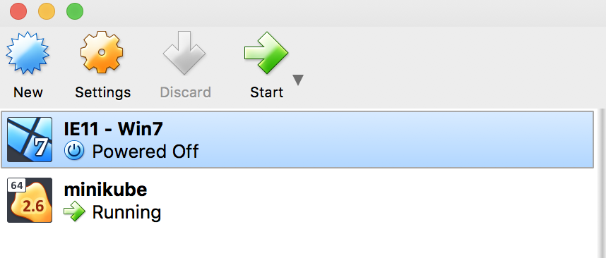

# Minikube
미니큐브는 로컬 컴퓨터에 가상 머신을 생성하고 하나의 노드만 포함하는 간단한 클러스터를 배포하는 작은 쿠버네티스입니다.

## 1. 설치
  * 필요한 Hypervisor(VirtualBox, VMware fusion, Hyperkit 등)를 설치합니다.

  * kubectl을 설치합니다.
  ~~~bash
  $ brew install kubectl
  ~~~

  * kubectl이 정상적으로 설치 되었는지 버전을 확인합니다.
  ~~~bash
  $ kubectl version
  ~~~

  * minikube를 설치합니다.(작성일 기준 0.28.0 버전 - [Release Version check](https://github.com/kubernetes/minikube/releases))
  ~~~bash
  $ curl -Lo minikube https://storage.googleapis.com/minikube/releases/v0.28.0/minikube-darwin-amd64 && chmod +x minikube && sudo mv minikube /usr/local/bin/
  ~~~
  혹은 Homebrew를 통해서 설치한다 
  ~~~bash
  brew cask install minikube
  ~~~

  * minikube가 정상적으로 설치 되었는지 버전을 확인합니다.
  ~~~bash
  $ minikube version
  ~~~

  * 클러스터를 생성합니다.
  ~~~bash
  $ minikube start
  ~~~

  성공적으로 실행 되면 아래와 같은 화면을 볼 수 있습니다.

  

  * 클러스터 상태를 확인합니다.
  ~~~bash
  $ kubectl cluster-info
  ~~~

  * 마스터가 정상적으로 동작되었다면 클러스터의 노드를 확인합니다.
  ~~~bash
  $ kubectl get nodes
  ~~~

  미니큐브가 정상적으로 실행 되고 있는 것을 확인 할 수 있습니다.
